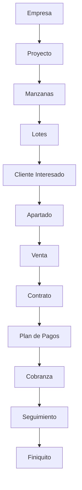

# ANÁLISIS SISTEMA LEGACY - ANVAR Inmobiliaria

**Análisis completo del sistema heredado para planificación de migración a CodeIgniter 4**

---

## 📋 RESUMEN EJECUTIVO

El sistema legacy de ANVAR Inmobiliaria es una aplicación web PHP7 procedural construida durante varios años, especializada en la gestión completa de proyectos inmobiliarios, ventas, cobranza y administración de clientes. Maneja el ciclo completo del negocio inmobiliario desde la lotificación hasta la cobranza de pagos.

### Datos Generales del Sistema
- **Punto de Entrada**: `login.php` 
- **Archivos Totales**: ~300 archivos PHP
- **Base de Datos**: MySQL con tablas prefijadas `tb_*`
- **Lenguaje**: Español (todas las interfaces y código)
- **Tecnología**: PHP 7.x procedural + jQuery + CSS personalizado

---

## 🏗️ ARQUITECTURA GENERAL

### Estructura de Directorios
```
sistema_legacy/
├── login.php                     # 🔐 Punto de entrada y autenticación
├── comandos/                     # 🧠 Lógica de negocio central
│   ├── funciones.php            # ⭐ NÚCLEO - Maneja toda la lógica via AJAX
│   ├── conexion.php             # 🗄️ Conexión BD (credenciales codificadas)
│   ├── menu.php                 # 🧭 Menú dinámico por permisos
│   └── base.php                 # 📄 Includes HTML comunes
├── [modulos].php                # 📁 Archivos por módulo de negocio
├── [modulos]_agregar.php        # ➕ Formularios de adición
├── [modulos]_modificar.php      # ✏️ Formularios de edición
├── reporte_*.php                # 📊 Sistema de reportes
├── css/                         # 🎨 Estilos personalizados
├── contratos/                   # 📄 Documentos generados
└── documentos/                  # 📋 Plantillas y archivos
```

### Patrón Arquitectónico
- **Arquitectura**: PHP procedural tradicional
- **Patrón de Datos**: Acceso directo a BD sin abstracción
- **Patrón de UI**: HTML/PHP mezclado en archivos únicos
- **Patrón de Lógica**: Centralizada en `comandos/funciones.php`

---

## 🔐 SISTEMA DE AUTENTICACIÓN

### Mecanismo de Login
```php
// login.php - Autenticación basada en sesiones
$_SESSION["ANV_U_LOG_L"] = true;
$_SESSION["ANV_U_LOG_ID"] = $usuario_id;
$_SESSION["ANV_U_LOG_NAME"] = $usuario_nombre;
$_SESSION["ANV_U_LOG_TYPE"] = $tipo_usuario;
```

### Tipos de Usuario Identificados
1. **Administrador** - Acceso completo al sistema
2. **Gerente** - Gestión de vendedores y proyectos
3. **Super Vendedor** - Ventas + gestión de equipos
4. **Vendedor** - Ventas y clientes asignados
5. **Visor** - Solo consulta de información

### Sistema de Permisos
- **Granular**: Permisos por módulo individual
- **Dinámico**: Menú se genera según permisos del usuario
- **Cookie-based**: Opción "Recordarme" con cookies

---

## 🗄️ ESTRUCTURA DE BASE DE DATOS

### Tablas Principales Identificadas
```sql
-- USUARIOS Y AUTENTICACIÓN
tb_usuarios                    # Usuarios del sistema
tb_grupos                     # Roles/grupos de usuario

-- GESTIÓN DE CLIENTES  
tb_clientes                   # Clientes principales
tb_expedientes               # Documentos por cliente

-- ESTRUCTURA INMOBILIARIA
tb_empresas                  # Empresas desarrolladoras
tb_proyectos                 # Proyectos inmobiliarios
tb_manzanas                  # Manzanas/bloques dentro de proyectos
tb_lotes                     # Lotes individuales
tb_amenidades                # Amenidades de proyectos

-- PROCESO DE VENTAS
tb_ventas                    # Transacciones de venta
tb_cobranza                  # Programación y seguimiento de pagos
tb_comisiones                # Comisiones de vendedores

-- CONFIGURACIÓN Y CATÁLOGOS
tb_tipos                     # Tipos de propiedades
tb_categorias                # Categorías de clasificación
tb_divisiones                # Divisiones administrativas
tb_configuracion             # Parámetros del sistema

-- OPERACIONES Y FINANZAS
tb_flujos                    # Flujos de efectivo
tb_egresos                   # Egresos y gastos
tb_gastos                    # Gastos operativos
tb_prestamos                 # Préstamos internos

-- SISTEMA Y AUDITORÍA
tb_bitacora                  # Log de actividades
tb_noticias                  # Noticias/comunicados
tb_movimientos_sistema       # Movimientos del sistema
tb_movimientos_turno         # Movimientos por turno
```

### Problemas de Integridad Identificados
```sql
-- ❌ PROBLEMAS CRÍTICOS
- No hay FOREIGN KEY constraints
- Relaciones implícitas solo en queries
- Datos desnormalizados en varias tablas
- Inconsistencias en tipos de datos
- Campos duplicados entre tablas relacionadas
```

---

## 🧠 LÓGICA DE NEGOCIO CENTRAL

### Archivo Núcleo: `comandos/funciones.php`
Este archivo de **~5000 líneas** contiene toda la lógica de negocio manejada via AJAX:

```php
// Estructura típica de funciones
switch ($_POST['accion']) {
    case 'agregar_cliente':
        // Lógica de agregar cliente
        break;
    case 'modificar_cliente':
        // Lógica de modificar cliente  
        break;
    case 'eliminar_cliente':
        // Lógica de eliminar cliente
        break;
    // ... 100+ casos más
}
```

### Funciones Críticas Identificadas
- **Gestión de Clientes**: CRUD completo + validaciones
- **Manejo de Ventas**: Cálculos de precios, enganches, intereses
- **Sistema de Cobranza**: Generación de calendarios de pago
- **Cálculo de Comisiones**: Algoritmos complejos por vendedor
- **Generación de Documentos**: Contratos, recibos, reportes PDF
- **Validaciones de Negocio**: RFC, CURP, límites de crédito

---

## 💼 MÓDULOS DE NEGOCIO IDENTIFICADOS

### 1. 👥 GESTIÓN DE CLIENTES
**Archivos**: `clientes.php`, `clientes_agregar.php`, `clientes_modificar.php`

**Funcionalidad**:
- CRUD completo de clientes
- Manejo de información personal y financiera
- Referencias familiares y laborales
- Historial de interacciones
- Estados de proceso (prospecto → cliente → comprador)

### 2. 🏗️ GESTIÓN DE PROYECTOS
**Archivos**: `proyectos.php`, `manzanas.php`, `lotes.php`, `amenidades.php`

**Funcionalidad**:
- Creación y gestión de proyectos inmobiliarios
- Lotificación con coordenadas geográficas
- Administración de manzanas y lotes
- Control de disponibilidad y precios
- Gestión de amenidades por proyecto

### 3. 💰 SISTEMA DE VENTAS
**Archivos**: `ventas.php`, `ventas_agregar.php`, `ventas_credito_presupuesto.php`

**Funcionalidad**:
- Proceso completo de venta
- Cálculo de enganches y financiamiento
- Generación de contratos automática
- Manejo de apartados y reservas
- Simulador de crédito integrado

### 4. 💳 SISTEMA DE COBRANZA
**Archivos**: `cobranza.php`, `cobranza_enviar.php`, `cobranza_historial.php`

**Funcionalidad**:
- Calendario de pagos automatizado
- Cálculo de intereses moratorios
- Generación de recibos
- Seguimiento de morosidad
- Reportes de cobranza

### 5. 👨‍💼 GESTIÓN DE VENDEDORES
**Archivos**: `usuarios.php`, `comisiones.php`, `vendedor_*.php`

**Funcionalidad**:
- Administración de equipos de ventas
- Cálculo automático de comisiones
- Asignación de clientes y territorios
- Reportes de performance
- Sistema de metas y bonificaciones

### 6. 📊 SISTEMA DE REPORTES
**Archivos**: `reporte_*.php` (15+ archivos)

**Funcionalidad**:
- Reportes de ventas por período
- Análisis de cobranza y morosidad  
- Reportes de comisiones
- Estados financieros
- Análisis de proyectos

### 7. 🗺️ SISTEMA DE MAPAS
**Archivos**: `mapa.php`, `mapa_dos.php`, `mapa_tres.php`, etc.

**Funcionalidad**:
- Visualización gráfica de lotificación
- Selección interactiva de lotes
- Estados visuales (disponible, vendido, apartado)
- Múltiples vistas por proyecto

---

## 🔄 FLUJO DE PROCESOS DE NEGOCIO

### Flujo Principal: Lotificación → Ventas → Cobranza



### Subprocesos Críticos

#### 1. Proceso de Lotificación
```
1. Crear Proyecto Inmobiliario
2. Definir Manzanas/Bloques  
3. Crear Lotes con coordenadas
4. Establecer precios y disponibilidad
5. Configurar amenidades
```

#### 2. Proceso de Venta
```
1. Captura de cliente prospecto
2. Selección de lote en mapa
3. Simulación de crédito
4. Generación de apartado
5. Firma de contrato
6. Configuración de plan de pagos
```

#### 3. Proceso de Cobranza
```
1. Generación automática de calendario
2. Emisión de recibos mensuales
3. Seguimiento de pagos
4. Cálculo de intereses moratorios
5. Gestión de cartera vencida
```

---

## ⚠️ PROBLEMAS Y RIESGOS IDENTIFICADOS

### 🔴 Críticos - Seguridad
```php
// ❌ SQL Injection vulnerabilities
$query = "SELECT * FROM tb_clientes WHERE id = " . $_POST['id'];

// ❌ Weak input sanitization  
$nombre = htmlspecialchars($_POST['nombre']);

// ❌ Direct superglobal usage
if ($_SESSION["ANV_U_LOG_L"] != true) { /* ... */ }
```

### 🟠 Altos - Arquitectura
- **Código Monolítico**: Toda la lógica en un archivo gigante
- **Acoplamiento Alto**: Módulos interdependientes sin abstracción
- **Duplicación de Código**: Mismas validaciones repetidas
- **Sin Manejo de Errores**: Errores no controlados pueden romper flujos

### 🟡 Medios - Mantenibilidad
- **Documentación Inexistente**: Solo comentarios esporádicos
- **Naming Inconsistente**: Mezcla de español/inglés
- **Hardcoded Values**: Configuraciones mezcladas con lógica
- **Archivos Gigantes**: Difíciles de mantener y debuggear

### 🔵 Bajos - Performance
- **N+1 Queries**: Consultas ineficientes en loops
- **Sin Caché**: Recálculos innecesarios
- **Archivos Grandes**: Carga completa de CSS/JS innecesaria

---

## 💡 FORTALEZAS DEL SISTEMA LEGACY

### ✅ Lógica de Negocio Robusta
- **Algoritmos Financieros**: Cálculos de intereses y comisiones bien probados
- **Validaciones de Negocio**: Reglas específicas del sector inmobiliario
- **Flujos Completos**: Procesos end-to-end funcionales
- **Integración Documental**: Generación automática de contratos/recibos

### ✅ Funcionalidades Avanzadas
- **Sistema de Mapas**: Visualización interactiva de lotificación
- **Simulador de Crédito**: Cálculos financieros en tiempo real
- **Reportes Complejos**: Análisis financieros detallados
- **Multi-proyecto**: Manejo de múltiples desarrollos inmobiliarios

### ✅ Experiencia de Usuario
- **Interfaz Intuitiva**: Diseñada por/para usuarios del sector
- **Flujos Optimizados**: Basados en años de experiencia
- **Reportes Útiles**: Información relevante para toma de decisiones

---

## 📁 ANÁLISIS DE ARCHIVOS CLAVE

### `comandos/funciones.php` (Núcleo del Sistema)
```php
// Patrón típico de manejo
switch ($_POST['accion']) {
    case 'agregar_venta':
        // 1. Validaciones básicas
        // 2. Cálculos financieros
        // 3. Insert en múltiples tablas
        // 4. Generación de documentos
        // 5. Response AJAX
        break;
}
```

**Problemas**:
- 5000+ líneas en un solo archivo
- Switch gigante con 100+ casos
- Lógica mezclada (validación + negocio + persistencia)
- Sin manejo de transacciones BD

### `login.php` (Autenticación)
```php
// Autenticación básica
if ($usuario_valido) {
    $_SESSION["ANV_U_LOG_L"] = true;
    $_SESSION["ANV_U_LOG_ID"] = $id;
    // Redirigir según tipo de usuario
}
```

**Problemas**:
- Sin protección contra session fixation
- Passwords posiblemente en texto plano
- Sin rate limiting para intentos

### Sistema de Reportes
```php
// Patrón típico de reportes
include 'comandos/conexion.php';
$query = "SELECT complejo_join_query...";
$result = mysqli_query($conexion, $query);
// Generar HTML/PDF directo
```

**Fortalezas**:
- Reportes muy específicos del negocio
- Datos útiles para gerencia
- Formato profesional

---

## 🔗 RELACIONES Y DEPENDENCIAS

### Interdependencias Críticas
```
EMPRESAS (1) ──────► PROYECTOS (N)
    │                    │
    │                    ▼
    └─► USUARIOS      MANZANAS (N)
              │           │
              ▼           ▼
         COMISIONES    LOTES (N)
                          │
                          ▼
CLIENTES ◄────────── VENTAS
    │                    │
    ▼                    ▼
EXPEDIENTES         COBRANZA
```

### Flujos de Datos Críticos
1. **Cliente → Venta → Cobranza**: Flujo principal de negocio
2. **Usuario → Comisiones**: Cálculo de comisiones por ventas
3. **Proyecto → Lotes → Ventas**: Disponibilidad y pricing
4. **Empresa → Configuración**: Parámetros globales

---

## 📊 MÉTRICAS Y VOLUMEN DE DATOS

### Estimación de Volumen (basado en análisis)
- **Clientes**: 500-2000 registros activos
- **Proyectos**: 5-20 proyectos simultáneos  
- **Lotes**: 1000-5000 lotes totales
- **Ventas**: 100-500 ventas anuales
- **Cobranza**: 5000-25000 pagos programados

### Archivos Críticos por Tamaño
1. `comandos/funciones.php` - ~5000 líneas (núcleo)
2. `ventas.php` - ~1000 líneas (ventas principales)
3. `cobranza.php` - ~800 líneas (cobranza)
4. `clientes.php` - ~600 líneas (gestión clientes)

---

## 🎯 CONCLUSIONES PARA MIGRACIÓN

### ✅ Elementos Reutilizables
- **Lógica de Negocio**: Algoritmos financieros y validaciones
- **Estructura de Datos**: Modelo relacional (con mejoras)
- **Flujos de Trabajo**: Procesos probados en producción
- **Reportes**: Información valiosa para el negocio

### ⚠️ Elementos a Reescribir
- **Arquitectura Completa**: De procedural a MVC/Entity
- **Sistema de Seguridad**: Autenticación y autorización modernos
- **Acceso a Datos**: ORM en lugar de SQL directo
- **Interfaz de Usuario**: AdminLTE en lugar de CSS custom

### 🚫 Elementos a Descartar
- **Código Inseguro**: SQL injection vulnerabilities
- **Patrones Obsoletos**: Mezcla HTML/PHP
- **Dependencias Legacy**: Librerías antiguas
- **Hardcoded Values**: Configuraciones fijas en código

---

**📝 Este análisis sirve como base fundamental para la planificación de la migración completa del sistema legacy al nuevo sistema CodeIgniter 4, manteniendo la funcionalidad crítica del negocio mientras se moderniza la arquitectura y se mejora la seguridad.**