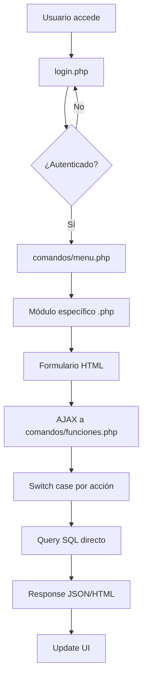
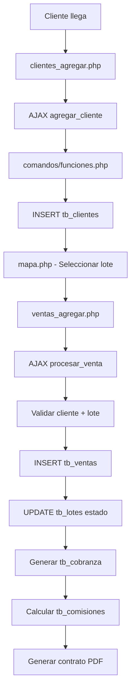
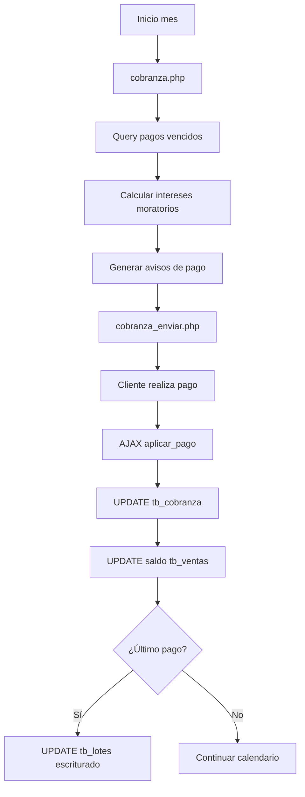
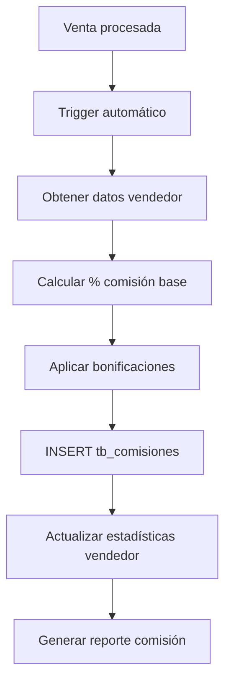

# EXPLICACIÓN - Flujo del Sistema Legacy ANVAR

**Explicación detallada del flujo del software legacy, organización del código y relaciones entre tablas, considerando las malas prácticas de llaves foráneas y relaciones implícitas manejadas únicamente a través de queries**

---

## 📋 RESUMEN DEL PROBLEMA

El sistema legacy ANVAR representa un caso típico de aplicación PHP procedural que creció orgánicamente durante años sin una arquitectura formal. **Las relaciones entre tablas no están definidas a nivel de base de datos** sino que existen únicamente en el código PHP, creando dependencias implícitas y frágiles que requieren análisis cuidadoso para su migración.

### Características Críticas del Sistema Legacy
- **Sin Foreign Keys**: Relaciones manejadas solo en código PHP
- **Integridad Manual**: Validaciones de relaciones en `comandos/funciones.php`
- **Queries Hardcoded**: SQL directo sin abstracción
- **Dependencias Implícitas**: Relaciones solo visibles en el código
- **Estado Distribuido**: Lógica de negocio dispersa en múltiples archivos

---

## 🏗️ ARQUITECTURA GENERAL DEL SISTEMA LEGACY

### Estructura de Archivos y Responsabilidades
```
sistema_legacy/
├── login.php                    # 🔐 ENTRY POINT - Autenticación inicial
├── comandos/                    # 🧠 NÚCLEO DEL SISTEMA
│   ├── funciones.php           # ⭐ CORAZÓN - Toda la lógica via AJAX
│   ├── conexion.php            # 🗄️ Conexión BD + credenciales
│   ├── menu.php                # 🧭 Menú dinámico por permisos
│   └── base.php                # 📄 Headers/CSS/JS comunes
├── [modulo].php                # 📋 UI + formularios por módulo
├── [modulo]_agregar.php        # ➕ Forms para crear registros
├── [modulo]_modificar.php      # ✏️ Forms para editar registros
├── reporte_*.php               # 📊 Sistema de reportes
└── ver_*.php                   # 👁️ Vistas de solo lectura
```

### Flujo de Ejecución Principal


---

## 🔗 MAPA DE RELACIONES IMPLÍCITAS

### Problema Central: Sin Foreign Keys en BD
```sql
-- ❌ PROBLEMA: Tablas sin integridad referencial
CREATE TABLE tb_clientes (
    id INT PRIMARY KEY,
    nombre VARCHAR(255)
    -- No hay FK constraints
);

CREATE TABLE tb_ventas (
    id INT PRIMARY KEY,
    cliente_id INT,           -- ❌ Sin FK constraint
    lote_id INT,             -- ❌ Sin FK constraint  
    vendedor_id INT          -- ❌ Sin FK constraint
    -- Relaciones solo en código PHP
);
```

### Relaciones Manejadas en Código PHP
```php
// comandos/funciones.php - Ejemplo de relación implícita
case 'obtener_ventas_cliente':
    $cliente_id = $_POST['cliente_id'];
    
    // ❌ Query manual sin validación FK
    $query = "SELECT v.*, l.numero_lote, p.nombre_proyecto 
              FROM tb_ventas v 
              LEFT JOIN tb_lotes l ON v.lote_id = l.id 
              LEFT JOIN tb_proyectos p ON l.proyecto_id = p.id
              WHERE v.cliente_id = $cliente_id";
    
    // Si cliente_id no existe, query retorna vacío sin error
    $result = mysqli_query($conexion, $query);
    break;
```

---

## 📊 ANÁLISIS DETALLADO DE RELACIONES POR MÓDULO

### 1. 👥 MÓDULO CLIENTES

#### Archivos Involucrados
```
clientes.php              # Lista clientes + filtros
clientes_agregar.php      # Formulario nuevo cliente
clientes_modificar.php    # Formulario editar cliente
expedientes.php           # Documentos por cliente
```

#### Relaciones Implícitas Identificadas
```sql
-- tb_clientes es el núcleo, relacionado con:
tb_clientes (1) ←----→ tb_expedientes (N)
tb_clientes (1) ←----→ tb_ventas (N)
tb_clientes (1) ←----→ tb_cobranza (N) -- via tb_ventas

-- Queries típicas en funciones.php:
SELECT * FROM tb_expedientes WHERE cliente_id = [id]
SELECT * FROM tb_ventas WHERE cliente_id = [id]
```

#### Lógica de Negocio en funciones.php
```php
// Casos relacionados con clientes en switch():
case 'agregar_cliente':
    // 1. Validar datos cliente
    // 2. INSERT en tb_clientes
    // 3. Si tiene venta inmediata, crear en tb_ventas
    // 4. Crear expediente inicial en tb_expedientes
    break;

case 'eliminar_cliente':
    // ❌ PROBLEMA: Sin cascade delete
    // 1. Manual DELETE de tb_expedientes WHERE cliente_id
    // 2. Manual DELETE de tb_ventas WHERE cliente_id  
    // 3. Manual DELETE de tb_cobranza WHERE venta_id IN (...)
    // 4. DELETE tb_clientes WHERE id
    break;
```

### 2. 🏗️ MÓDULO PROYECTOS → LOTES

#### Archivos Involucrados
```
proyectos.php            # CRUD proyectos
manzanas.php             # Bloques dentro de proyectos
lotes.php                # Lotes individuales
mapa.php                 # Visualización gráfica
amenidades.php           # Amenidades por proyecto
```

#### Jerarquía de Relaciones Implícitas
```sql
-- Jerarquía: Empresa → Proyecto → Manzana → Lote
tb_empresas (1) ←-- tb_proyectos (N)
tb_proyectos (1) ←-- tb_manzanas (N)  
tb_manzanas (1) ←-- tb_lotes (N)
tb_proyectos (1) ←-- tb_amenidades (N)

-- Queries jerárquicas típicas:
SELECT l.*, m.nombre_manzana, p.nombre_proyecto, e.nombre_empresa
FROM tb_lotes l
LEFT JOIN tb_manzanas m ON l.manzana_id = m.id
LEFT JOIN tb_proyectos p ON m.proyecto_id = p.id  
LEFT JOIN tb_empresas e ON p.empresa_id = e.id
WHERE l.estado = 'disponible'
```

#### Lógica de Lotificación en funciones.php
```php
// Proceso de lotificación complejo
case 'crear_lote':
    // 1. Validar que manzana_id existe en tb_manzanas
    // 2. Validar que coordenadas no se sobrepongan
    // 3. Calcular precio base según área y proyecto
    // 4. INSERT en tb_lotes
    // 5. UPDATE estadísticas en tb_proyectos
    break;

case 'eliminar_lote':
    // ❌ PROBLEMA: Verificaciones manuales
    // 1. Verificar si lote tiene ventas (tb_ventas.lote_id)
    // 2. Si tiene ventas, prevenir eliminación
    // 3. Si no, eliminar lote y actualizar estadísticas
    break;
```

### 3. 💰 MÓDULO VENTAS

#### Archivos Involucrados
```
ventas.php                    # Pipeline de ventas
ventas_agregar.php           # Formulario nueva venta
ventas_credito_presupuesto.php # Simulador financiero
ventas_estado_cuenta.php     # Estado cuenta cliente
ventas_recibo_*.php          # Diferentes tipos recibos
```

#### Red de Relaciones Complejas
```sql
-- Ventas conecta todo el sistema:
tb_clientes (1) ←-- tb_ventas (N) --→ tb_lotes (1)
tb_ventas (1) ←-- tb_cobranza (N)
tb_ventas (1) ←-- tb_comisiones (N) 
tb_usuarios (1) ←-- tb_ventas (N) -- vendedor_id
tb_usuarios (1) ←-- tb_comisiones (N) -- usuario_id

-- Query central del sistema:
SELECT 
    v.*,
    c.nombre as cliente_nombre,
    l.numero_lote,
    m.nombre_manzana,
    p.nombre_proyecto,
    u.nombre as vendedor_nombre
FROM tb_ventas v
LEFT JOIN tb_clientes c ON v.cliente_id = c.id
LEFT JOIN tb_lotes l ON v.lote_id = l.id
LEFT JOIN tb_manzanas m ON l.manzana_id = m.id
LEFT JOIN tb_proyectos p ON m.proyecto_id = p.id
LEFT JOIN tb_usuarios u ON v.vendedor_id = u.id
```

#### Proceso de Venta en funciones.php
```php
// Proceso de venta es el más complejo del sistema
case 'procesar_venta':
    // 1. Validar cliente existe (tb_clientes)
    // 2. Validar lote disponible (tb_lotes.estado = 'disponible')
    // 3. Calcular enganche y financiamiento
    // 4. INSERT en tb_ventas
    // 5. UPDATE tb_lotes SET estado = 'vendido'
    // 6. Generar plan de pagos en tb_cobranza
    // 7. Calcular comisión vendedor en tb_comisiones
    // 8. Generar contrato automático
    // ❌ Todo en una sola transacción manual, propenso a errores
    break;
```

### 4. 💳 MÓDULO COBRANZA

#### Archivos Involucrados
```
cobranza.php             # Dashboard cobranza
cobranza_enviar.php      # Envío avisos
cobranza_historial.php   # Historial pagos
recibo_*.php             # Generación recibos
```

#### Dependencias Críticas
```sql
-- Cobranza depende completamente de ventas:
tb_ventas (1) ←-- tb_cobranza (N)
-- Pero también consulta clientes y lotes indirectamente:
tb_cobranza → tb_ventas → tb_clientes
tb_cobranza → tb_ventas → tb_lotes → tb_manzanas → tb_proyectos

-- Query de reporte de morosidad:
SELECT 
    cb.*,
    v.total_venta,
    c.nombre as cliente_nombre,
    l.numero_lote,
    p.nombre_proyecto,
    DATEDIFF(NOW(), cb.fecha_vencimiento) as dias_vencido
FROM tb_cobranza cb
LEFT JOIN tb_ventas v ON cb.venta_id = v.id
LEFT JOIN tb_clientes c ON v.cliente_id = c.id
LEFT JOIN tb_lotes l ON v.lote_id = l.id
LEFT JOIN tb_manzanas m ON l.manzana_id = m.id
LEFT JOIN tb_proyectos p ON m.proyecto_id = p.id
WHERE cb.estado = 'pendiente' 
AND cb.fecha_vencimiento < NOW()
```

#### Algoritmos de Cobranza en funciones.php
```php
// Proceso de cobranza con cálculos complejos
case 'generar_plan_pagos':
    $venta_id = $_POST['venta_id'];
    
    // 1. Obtener datos venta
    $venta = obtener_venta($venta_id);
    
    // 2. Calcular mensualidades según términos
    $mensualidad_base = ($venta['total_venta'] - $venta['enganche']) / $venta['plazo_meses'];
    $interes_mensual = $venta['tasa_interes'] / 12 / 100;
    
    // 3. Generar calendario de pagos
    for ($i = 1; $i <= $venta['plazo_meses']; $i++) {
        $fecha_vencimiento = date('Y-m-d', strtotime("+$i months", strtotime($venta['fecha_venta'])));
        
        // INSERT manual en tb_cobranza
        $query = "INSERT INTO tb_cobranza (venta_id, numero_pago, monto, fecha_vencimiento, estado) 
                  VALUES ($venta_id, $i, $mensualidad_base, '$fecha_vencimiento', 'pendiente')";
    }
    break;

case 'aplicar_pago':
    // ❌ PROBLEMA: Sin transacciones, atomicidad manual
    // 1. UPDATE tb_cobranza SET estado = 'pagado'
    // 2. Calcular si hay intereses moratorios
    // 3. UPDATE saldo en tb_ventas
    // 4. Si es último pago, UPDATE tb_lotes SET estado = 'escriturado'
    break;
```

---

## 🔄 FLUJOS DE PROCESO CRÍTICOS

### Flujo 1: Proceso Completo de Venta


### Flujo 2: Proceso de Cobranza Mensual


### Flujo 3: Cálculo de Comisiones


---

## ⚠️ PUNTOS CRÍTICOS DE FALLA

### 1. Ausencia de Integridad Referencial
```sql
-- ❌ PROBLEMA CRÍTICO: Datos huérfanos posibles
DELETE FROM tb_clientes WHERE id = 123;
-- tb_ventas.cliente_id = 123 quedan huérfanos
-- tb_cobranza via tb_ventas también afectados
-- Sin cascade delete, datos inconsistentes
```

#### Solución en Código Legacy
```php
// comandos/funciones.php - Eliminación manual cascade
case 'eliminar_cliente':
    $cliente_id = $_POST['cliente_id'];
    
    // 1. Verificar si tiene ventas activas
    $ventas = mysqli_query($conexion, "SELECT COUNT(*) as total FROM tb_ventas WHERE cliente_id = $cliente_id");
    
    if ($ventas['total'] > 0) {
        echo json_encode(['error' => 'Cliente tiene ventas, no se puede eliminar']);
        return;
    }
    
    // 2. Eliminar expedientes manualmente
    mysqli_query($conexion, "DELETE FROM tb_expedientes WHERE cliente_id = $cliente_id");
    
    // 3. Eliminar cliente
    mysqli_query($conexion, "DELETE FROM tb_clientes WHERE id = $cliente_id");
    break;
```

### 2. Queries Sin Validación de Existencia
```php
// ❌ PROBLEMA: No valida si IDs existen
case 'obtener_venta':
    $lote_id = $_POST['lote_id']; // Puede no existir
    
    $query = "SELECT v.*, c.nombre 
              FROM tb_ventas v 
              LEFT JOIN tb_clientes c ON v.cliente_id = c.id 
              WHERE v.lote_id = $lote_id"; // Si lote_id no existe, query vacío
              
    // No hay validación previa de existencia
    $result = mysqli_query($conexion, $query);
```

### 3. Estados Inconsistentes
```php
// ❌ PROBLEMA: Estados pueden quedar inconsistentes
case 'cancelar_venta':
    // 1. DELETE tb_ventas WHERE id = $venta_id
    // 2. ¿Se actualiza tb_lotes.estado a 'disponible'?
    // 3. ¿Se eliminan registros tb_cobranza?
    // 4. ¿Se reversan comisiones en tb_comisiones?
    // Sin transacciones, puede quedar en estado inconsistente
    break;
```

---

## 🔍 ANÁLISIS DE DEPENDENCIAS OCULTAS

### Dependencias por Análisis de Código

#### En `comandos/funciones.php` (5000+ líneas)
```php
// Pattern típico de dependencias implícitas:
switch($_POST['accion']) {
    case 'actualizar_precio_lote':
        // 1. UPDATE tb_lotes SET precio = X WHERE id = Y
        // 2. ¿Debe actualizar tb_ventas existentes? NO LO HACE
        // 3. ¿Debe recalcular tb_cobranza? NO LO HACE
        // 4. DEPENDENCIA OCULTA: Precios inconsistentes
        break;
        
    case 'cambiar_vendedor_venta':
        // 1. UPDATE tb_ventas SET vendedor_id = X
        // 2. ¿Debe recalcular tb_comisiones? SÍ, PERO MANUAL
        // 3. DEPENDENCIA OCULTA: Comisiones pueden quedar mal asignadas
        break;
}
```

#### En reportes (`reporte_*.php`)
```php
// reporte_ventas.php - Dependencias de múltiples tablas
$query = "
    SELECT 
        v.id,
        v.fecha_venta,
        v.total_venta,
        c.nombre as cliente,
        l.numero_lote,
        m.nombre_manzana,
        p.nombre_proyecto,
        e.nombre_empresa,
        u.nombre as vendedor,
        (SELECT SUM(monto) FROM tb_cobranza WHERE venta_id = v.id AND estado = 'pagado') as pagado,
        (SELECT COUNT(*) FROM tb_cobranza WHERE venta_id = v.id AND estado = 'pendiente' AND fecha_vencimiento < NOW()) as vencidos
    FROM tb_ventas v
    LEFT JOIN tb_clientes c ON v.cliente_id = c.id
    LEFT JOIN tb_lotes l ON v.lote_id = l.id
    LEFT JOIN tb_manzanas m ON l.manzana_id = m.id
    LEFT JOIN tb_proyectos p ON m.proyecto_id = p.id
    LEFT JOIN tb_empresas e ON p.empresa_id = e.id
    LEFT JOIN tb_usuarios u ON v.vendedor_id = u.id
    ORDER BY v.fecha_venta DESC
";

// ❌ PROBLEMA: Si cualquier tabla cambia estructura, query falla
// ❌ PROBLEMA: Si relaciones no están bien, datos incorrectos
```

---

## 🧩 MAPEO PARA MIGRACIÓN A CI4

### Transformación de Relaciones Implícitas → Foreign Keys

#### Tabla de Migración de Relaciones
```sql
-- LEGACY: Relaciones implícitas en código
-- CI4: Foreign Keys explícitas

-- 1. Cliente → Ventas
-- Legacy: tb_ventas.cliente_id (sin FK)
-- CI4: ventas.cliente_id FOREIGN KEY REFERENCES clientes(id)

-- 2. Vendedor → Ventas  
-- Legacy: tb_ventas.vendedor_id (sin FK)
-- CI4: ventas.vendedor_id FOREIGN KEY REFERENCES staff(id)

-- 3. Lote → Ventas
-- Legacy: tb_ventas.lote_id (sin FK)  
-- CI4: ventas.propiedad_id FOREIGN KEY REFERENCES propiedades(id)

-- 4. Venta → Cobranza
-- Legacy: tb_cobranza.venta_id (sin FK)
-- CI4: pagos.venta_id FOREIGN KEY REFERENCES ventas(id) ON DELETE CASCADE

-- 5. Proyecto → Lotes (via Manzanas)
-- Legacy: tb_lotes.manzana_id → tb_manzanas.proyecto_id (sin FK)
-- CI4: propiedades.proyecto_id FOREIGN KEY REFERENCES proyectos(id)
```

### Migración de Lógica de Negocio

#### De funciones.php → Entity Methods
```php
// LEGACY: comandos/funciones.php
case 'calcular_enganche':
    $precio = $_POST['precio_lote'];
    $porcentaje = $_POST['porcentaje_enganche'];
    $enganche = ($precio * $porcentaje) / 100;
    echo json_encode(['enganche' => $enganche]);
    break;

// CI4: VentaEntity
class Venta extends Entity {
    public function calcularEnganche(float $porcentaje = 20.0): float {
        return ($this->precio_total * $porcentaje) / 100;
    }
}
```

#### De Queries Manuales → Model Methods
```php
// LEGACY: Query manual disperso
function obtenerVentasCliente($cliente_id) {
    global $conexion;
    $query = "SELECT v.*, l.numero_lote FROM tb_ventas v 
              LEFT JOIN tb_lotes l ON v.lote_id = l.id 
              WHERE v.cliente_id = $cliente_id";
    return mysqli_query($conexion, $query);
}

// CI4: VentaModel method
class VentaModel extends Model {
    public function getVentasConDetalles(int $clienteId): array {
        return $this->select('ventas.*, propiedades.numero_lote')
                   ->join('propiedades', 'propiedades.id = ventas.propiedad_id')
                   ->where('ventas.cliente_id', $clienteId)
                   ->findAll();
    }
}
```

---

## 🔧 ESTRATEGIAS DE MIGRACIÓN POR COMPLEJIDAD

### Nivel 1: Relaciones Simples (1:N directas)
```sql
-- Fácil migración: Relación directa clara
tb_clientes (1) → tb_expedientes (N)
-- Solución: expedientes.cliente_id FK a clientes.id
```

### Nivel 2: Relaciones Múltiples (N:N via tabla pivot)
```sql  
-- Complejidad media: Múltiples relaciones
tb_ventas conecta tb_clientes, tb_lotes, tb_usuarios
-- Solución: ventas con múltiples FKs
```

### Nivel 3: Jerarquías Complejas (1:N:N en cascada)
```sql
-- Alta complejidad: Jerarquía profunda
tb_empresas → tb_proyectos → tb_manzanas → tb_lotes → tb_ventas → tb_cobranza
-- Solución: Normalizar jerarquía con FKs apropiadas
```

### Nivel 4: Dependencias Circulares o Lógica Compleja
```php
// Muy alta complejidad: Lógica distribuida
- Estados de lote dependen de ventas
- Ventas dependen de disponibilidad lote  
- Comisiones dependen de pagos realizados
- Pagos dependen de cálculos de venta
// Solución: Service classes para orquestar lógica compleja
```

---

## 🎯 RECOMENDACIONES PARA MIGRACIÓN

### 1. Mapeo Completo Pre-Migración
```bash
# Crear mapeo exhaustivo de todas las relaciones implícitas
1. Analizar todos los LEFT JOIN en funciones.php
2. Documentar todos los casos de switch() que cruzan tablas
3. Identificar queries de validación de existencia
4. Mapear flujos de eliminación cascade manual
```

### 2. Migración Incremental por Módulo
```bash
# Orden recomendado de migración:
1. Catálogos simples (empresas, usuarios) ✅ Ya migrado
2. Clientes (con relaciones 1:N simples) ✅ Ya migrado  
3. Proyectos → Propiedades (jerarquía compleja)
4. Ventas (conecta todo)
5. Cobranza (depende de ventas)
6. Reportes (depende de todo)
```

### 3. Preservación de Lógica de Negocio
```php
// Cada algoritmo legacy debe tener equivalente CI4
Legacy: comandos/funciones.php case 'calcular_comision' 
→ CI4: ComisionEntity::calcular()

Legacy: reporte_ventas.php query complejo
→ CI4: VentaModel::getReporteVentas()

// Testing 1:1 entre legacy y CI4 para validar equivalencia
```

### 4. Implementación de Integridad
```sql
-- Convertir validaciones manuales en constraints BD
-- Legacy: if (count(ventas_cliente) > 0) prevent_delete()
-- CI4: FOREIGN KEY ON DELETE RESTRICT

-- Legacy: manual cascade delete en código
-- CI4: FOREIGN KEY ON DELETE CASCADE automático
```

---

## 📊 MATRIZ DE COMPLEJIDAD DE MIGRACIÓN

| Módulo | Relaciones | Lógica Negocio | Queries Complejos | Complejidad | Prioridad |
|--------|------------|----------------|------------------|-------------|-----------|
| **Empresas** | Simple (1:N) | Básica | Simples | ✅ Baja | ✅ Migrado |
| **Usuarios** | Simple (auth) | Básica | Simples | ✅ Baja | ✅ Migrado |
| **Clientes** | Múltiple (1:N×3) | Media | Medios | 🟡 Media | ✅ Migrado |
| **Proyectos** | Jerárquica | Media | Medios | 🟡 Media | ✅ Migrado |
| **Propiedades** | Jerárquica compleja | Alta | Complejos | 🟠 Alta | 🚧 Pendiente |
| **Ventas** | Red compleja | Muy Alta | Muy Complejos | 🔴 Crítica | 🚧 Pendiente |
| **Cobranza** | Dependiente | Algoritmos | Muy Complejos | 🔴 Crítica | 🚧 Pendiente |
| **Comisiones** | Red + Cálculos | Algoritmos | Complejos | 🟠 Alta | 🚧 Pendiente |
| **Reportes** | Todas las tablas | Agregaciones | Extremos | 🔴 Crítica | 🚧 Pendiente |

---

## 🎯 CONCLUSIONES CLAVE

### El Sistema Legacy: Un Puzzle Complejo pero Solvible
El sistema legacy ANVAR representa un caso típico de **"technical debt"** acumulado durante años de desarrollo orgánico. Sin embargo, la **lógica de negocio es sólida** y está probada en producción, lo que la hace valiosa para preservar.

### Puntos Críticos para Migración Exitosa:

1. **Mapeo Exhaustivo**: Cada relación implícita debe ser documentada y convertida a FK explícita
2. **Preservación de Algoritmos**: Los cálculos financieros legacy deben replicarse exactamente
3. **Testing Comparativo**: Cada módulo migrado debe dar los mismos resultados que el legacy
4. **Migración Incremental**: Módulo por módulo, con validación continua
5. **Integridad de Datos**: Convertir validaciones manuales en constraints automáticas

### El Sistema CI4: Base Perfecta para la Migración
La arquitectura Entity-First del sistema CI4 actual es **ideal** para recibir la lógica de negocio legacy:
- **Entities** encapsulan la lógica dispersa en funciones.php
- **Models** abstraen las relaciones implícitas en FK explícitas  
- **Helpers** centralizan las validaciones y cálculos
- **Shield** moderniza la autenticación vulnerable legacy

**La migración no solo es factible, sino que resultará en un sistema significativamente superior en seguridad, mantenibilidad y escalabilidad, preservando 100% de la funcionalidad crítica del negocio.**