# 🏦 ANÁLISIS DE RELACIONES BANCARIAS - BASE DE DATOS LEGACY

## 📊 Información de la Empresa
```
ANVAR Inmobiliaria
RUC/RFC: LDH191210PI0
Dirección: AV. CRUZ LIZARRAGA 901 L21-22, PALOS PRIETOS, MAZATLAN, SINALOA. 82010
Teléfono: 669 238 5285
Email: contacto@anvarinmobiliaria.com
Representante Legal: LIC. RODOLFO SANDOVAL PELAYO
```

## 🏗️ ESTRUCTURA PRINCIPAL DE CUENTAS BANCARIAS

### 📋 Tabla: `tb_cuentas_proyectos`

**Propósito**: Gestión de cuentas bancarias asociadas a proyectos inmobiliarios

#### Estructura de Campos:
| Campo | Tipo | Descripción | Relación |
|-------|------|-------------|----------|
| `IdCuenta` | INT(11) PK | Identificador único de cuenta | - |
| `Descripcion` | VARCHAR(1000) | Nombre/descripción de la cuenta | - |
| `Proyecto` | INT(11) FK | ID del proyecto asociado | → tb_proyectos.IdProyecto |
| `NProyecto` | VARCHAR(1000) | Nombre del proyecto (desnormalizado) | - |
| `Banco` | VARCHAR(1000) | Nombre del banco | - |
| `Tarjeta` | VARCHAR(100) | Número de cuenta/tarjeta | - |
| `Clabe` | VARCHAR(100) | CLABE interbancaria | - |
| `Color` | VARCHAR(100) | Color para identificación visual | - |
| `Saldo` | DOUBLE | Saldo actual de la cuenta | - |
| `Estatus` | INT(11) | Estado de la cuenta (0=Inactiva, 1=Activa) | - |
| `Usuario` | INT(11) FK | Usuario que creó/modificó | → tb_usuarios.IdUsuario |
| `NUsuario` | VARCHAR(1000) | Nombre del usuario (desnormalizado) | - |
| `Fecha` | DATE | Fecha de creación/modificación | - |
| `Hora` | TIME | Hora de creación/modificación | - |
| `IP` | VARCHAR(100) | Dirección IP del registro | - |
| `Empresa` | INT(11) FK | ID de la empresa | → tb_empresas.IdEmpresa |
| `NEmpresa` | VARCHAR(1000) | Nombre de la empresa (desnormalizado) | - |
| `Deposito` | TINYINT(4) | Permite depósitos (0=No, 1=Sí) | - |
| `Logotipo` | VARCHAR(1000) | Ruta del logotipo del banco | - |
| `Titular` | VARCHAR(1000) | Nombre del titular de la cuenta | - |
| `Convenio` | VARCHAR(1000) | Número de convenio bancario | - |
| `SWIFT` | TEXT | Código SWIFT para transferencias internacionales | - |

#### Registros Existentes:
```sql
-- Cuenta de Efectivo para Valle Natura
(5, 'EFECTIVO', 1, 'Valle Natura', 'EFECTIVO', '000000000000000', '000000000000000000', 
'43ff2f', 453809.13, 1, 0, NULL, NULL, NULL, NULL, 1, 'ANVAR Inmobiliaria', 0, NULL, 
'LCG DESARROLLOS HABITACIONALES SA DE CV', NULL, NULL)

-- Cuenta BBVA para Valle Natura  
(6, 'LCG DESARROLLOS HABITACIONALES SA DE CV', 1, 'Valle Natura', 'BBVA', '0119880240', 
'012744001198802405', '2fb6ff', 11775851.61, 1, 0, NULL, NULL, NULL, NULL, 1, 
'ANVAR Inmobiliaria', 1, NULL, 'LCG DESARROLLOS HABITACIONALES SA DE CV', NULL, NULL)
```

## 🔗 DIAGRAMA DE RELACIONES

```mermaid
erDiagram
    tb_cuentas_proyectos {
        int IdCuenta PK
        varchar Descripcion
        int Proyecto FK
        varchar NProyecto
        varchar Banco
        varchar Tarjeta
        varchar Clabe
        varchar Color
        double Saldo
        int Estatus
        int Usuario FK
        varchar NUsuario
        date Fecha
        time Hora
        varchar IP
        int Empresa FK
        varchar NEmpresa
        tinyint Deposito
        varchar Logotipo
        varchar Titular
        varchar Convenio
        text SWIFT
    }
    
    tb_proyectos {
        int IdProyecto PK
        varchar Nombre
        varchar Clave
        text Descripcion
        text Ubicacion
        date Fecha
        time Hora
        varchar Color
        varchar Longitud
        varchar Latitud
        int Estatus
        int Empresa FK
        varchar NEmpresa
        varchar NComercial
        varchar Parcela
        varchar Ejido
        varchar Telefono
        varchar Logotipo
        varchar Email
        double PenalizacionM
        double PenalizacionA
        tinyint Intereses
        varchar Mapa
        varchar RazonSocial
        varchar RFC
        text Domicilio
    }
    
    tb_cobranza_pagos {
        int IdHistorial PK
        int Cobranza FK
        int Ingreso
        int Cuenta FK
        int Venta FK
        double Total
        double Efectivo
        double Cheque
        double Transferencia
        double Tarjeta
        varchar Observaciones
        int Usuario FK
        varchar NUsuario
        date Fecha
        time Hora
        int Tipo
        varchar NTipo
        int Concepto
        varchar NConcepto
        int Estado
    }
    
    tb_ventas {
        int IdVenta PK
        varchar Folio
        double Total
        double TotalPagado
        int Forma FK
        varchar NForma
        int Proyecto FK
        varchar NProyecto
        int Manzana FK
        varchar NManzana
        int Lote FK
        varchar NLote
        int Vendedor FK
        varchar NVendedor
        int Cliente FK
        varchar NCliente
        varchar Telefono
        int Tipo
        varchar NTipo
        int Estado
        varchar NEstado
        date Fecha
        time Hora
        int Usuario FK
        varchar NUsuario
        varchar IP
        int Estatus
        tinyint Credito
        tinyint Cobrado
        double Anticipo
        double AnticipoPagado
        tinyint AnticipoCredito
        tinyint AnticipoCobrado
        double Area
        text Observaciones
        int Empresa FK
        varchar NEmpresa
        varchar Descuento
        varchar TipoDescuento
        varchar TipoAnticipo
        double ComisionApartado
        double ComisionTotal
        date FechaSistema
        varchar Contrato
        tinyint ContratoCargado
        date FechaCarga
        time HoraCarga
        int IntervaloCancelacion
        int DiasCancelacion
    }
    
    tb_cobranza {
        int IdCobranza PK
        double Total
        double TotalPagado
        int Proyecto FK
        varchar NProyecto
        int Lote FK
        varchar NLote
        int Cliente FK
        varchar NCliente
        int TipoCredito
        varchar NTipoCredito
        date Fecha
        time Hora
        int Usuario FK
        varchar NUsuario
        varchar IP
        int Estatus
        text Observaciones
        int Manzana FK
        varchar NManzana
        int Vendedor FK
        varchar NVendedor
        int Venta FK
        int DiasCredito
        date FechaFinal
        varchar Plazo
        date FechaPago
        time HoraPago
        tinyint Cobrado
        int Empresa FK
        varchar NEmpresa
        date FechaReferencia
        tinyint Enviado
        date FechaEnviado
        time HoraEnviado
        varchar EmailEnviado
        double Interes
        tinyint ComprobanteCargado
        varchar Comprobante
        date FechaCarga
        time HoraCarga
        tinyint InteresCargado
        int MesesInteres
        varchar TextoFecha
        tinyint Liquidado
        tinyint MarcadoCobranza
        double TotalSI
    }
    
    tb_clientes {
        int IdCliente PK
        varchar Nombre
        varchar RazonSocial
        varchar RFC
        text Domicilio
        varchar Numero
        varchar Colonia
        varchar CP
        varchar Ciudad
        varchar Estado
        varchar Contacto
        varchar Telefono
        varchar Email
        int Estatus
        date Fecha
        time Hora
        int Usuario FK
        varchar NUsuario
        varchar IP
        tinyint Acceso
        varchar Clave
        tinyint Verificada
        date FechaVerificada
        time HoraVerificada
        varchar IPVerificada
        varchar HashCookie
        varchar TextoVendedor
        varchar CURP
        int EstadoCivil
        varchar NEstadoCivil
        int Empresa FK
        varchar NEmpresa
        varchar NombreReferenciaUno
        varchar TelefonoReferenciaUno
        varchar NombreReferenciaDos
        varchar TelefonoReferenciaDos
        varchar Telefono2
        varchar Identificacion
        date FechaNacimiento
        varchar LugarNacimiento
        varchar Profesion
        int Genero
        varchar Tiempo
        text TipoResidencia
        text Conyuge
        text ProfesionConyuge
        text ParentescoReferenciaUno
        text ParentescoReferenciaDos
        varchar TelefonoBeneficiario
    }
    
    tb_financiamientos {
        int IdFinanciamiento PK
        varchar Nombre
        double Porcentaje
        int Mensualidades
        double Descuento
        int Estatus
    }
    
    tb_formas_pago {
        int IdForma PK
        varchar Nombre
    }

    %% Relaciones principales
    tb_cuentas_proyectos ||--|| tb_proyectos : "Proyecto"
    tb_cobranza_pagos ||--|| tb_cuentas_proyectos : "Cuenta"
    tb_cobranza_pagos ||--|| tb_ventas : "Venta"
    tb_cobranza_pagos ||--|| tb_cobranza : "Cobranza"
    tb_ventas ||--|| tb_proyectos : "Proyecto"
    tb_ventas ||--|| tb_clientes : "Cliente"
    tb_cobranza ||--|| tb_proyectos : "Proyecto"
    tb_cobranza ||--|| tb_ventas : "Venta"
    tb_cobranza ||--|| tb_clientes : "Cliente"
```



## 💰 FLUJO DE TRANSACCIONES BANCARIAS

### 1. **Proceso de Venta**
```
tb_clientes → tb_ventas → tb_cobranza → tb_cobranza_pagos → tb_cuentas_proyectos
```

### 2. **Registro de Pagos**
- **Efectivo**: Cuenta ID=5 (Valle Natura - Efectivo)
- **Transferencia**: Cuenta ID=6 (BBVA - LCG DESARROLLOS HABITACIONALES)
- **Cheque**: Se registra en la cuenta correspondiente
- **Tarjeta**: Se registra según configuración del proyecto

### 3. **Control de Saldos**
- El campo `Saldo` en `tb_cuentas_proyectos` se actualiza con cada transacción
- Los pagos se registran en `tb_cobranza_pagos` con referencia a la cuenta

## 🔧 CAMPOS DESNORMALIZADOS (Patrón "N")

> **Nota importante**: El prefijo "N" significa "Nombre" y representa datos desnormalizados

| Campo Normalizado | Campo Desnormalizado | Descripción |
|-------------------|---------------------|-------------|
| `Proyecto` | `NProyecto` | ID vs Nombre del Proyecto |
| `Usuario` | `NUsuario` | ID vs Nombre del Usuario |
| `Empresa` | `NEmpresa` | ID vs Nombre de la Empresa |

## 📈 ESTADÍSTICAS ACTUALES (Ejemplo)

### Cuentas Bancarias Valle Natura:
- **Efectivo**: $453,809.13
- **BBVA**: $11,775,851.61
- **Total**: $12,229,660.74

## 🚀 RECOMENDACIONES PARA MIGRACIÓN

### 1. **Normalización de Datos**
```sql
-- Crear tabla independiente para bancos
CREATE TABLE bancos (
    id INT PRIMARY KEY,
    nombre VARCHAR(255),
    codigo_swift VARCHAR(20)
);

-- Limpiar campos desnormalizados
-- Mantener solo referencias FK, eliminar campos "N"
```

### 2. **Modernización de Estructura**
- Separar cuentas bancarias de proyectos
- Crear tabla de transacciones bancarias independiente
- Implementar auditoria con timestamps automáticos
- Agregar validaciones de integridad referencial

### 3. **Campos Críticos a Migrar**
- `CLABE` → Validación de formato mexicano
- `Titular` → Normalizar con datos del cliente/empresa
- `Saldo` → Calcular en tiempo real desde transacciones
- `SWIFT` → Validación de códigos internacionales

## 🔒 CONSIDERACIONES DE SEGURIDAD

1. **Datos Sensibles**: CLABE, número de cuenta, SWIFT
2. **Auditoría**: Mantener log de cambios en saldos
3. **Validaciones**: Formato de cuentas bancarias mexicanas
4. **Encriptación**: Considerar encriptar números de cuenta

## 🔗 MÓDULOS QUE DEPENDEN DE CUENTAS BANCARIAS

### **Análisis de Dependencias Legacy**

La tabla `tb_cuentas_proyectos` es **CRÍTICA** para el funcionamiento del sistema, ya que **8 módulos principales** dependen directamente de ella:

#### 1. **tb_cobranza_pagos** - Módulo de Pagos de Cobranza
- **Relación**: `Cuenta` FK → `tb_cuentas_proyectos.IdCuenta`
- **Función**: Registra todos los pagos realizados por clientes
- **Criticidad**: ⚡ **ALTA** - Sin cuentas bancarias, no se pueden registrar pagos

#### 2. **tb_egresos** - Módulo de Egresos/Gastos
- **Relación**: `Cuenta` FK → `tb_cuentas_proyectos.IdCuenta`
- **Función**: Registra salidas de dinero de las cuentas
- **Criticidad**: ⚡ **ALTA** - Control de gastos operativos

#### 3. **tb_egresos_detalles** - Detalles de Egresos
- **Relación**: `Cuenta` FK → `tb_cuentas_proyectos.IdCuenta`
- **Función**: Detalla conceptos específicos de cada gasto
- **Criticidad**: 🔸 **MEDIA** - Auditoría detallada de gastos

#### 4. **tb_ingresos** - Módulo de Ingresos
- **Relación**: `Cuenta` FK → `tb_cuentas_proyectos.IdCuenta`
- **Función**: Registra entradas de dinero a las cuentas
- **Criticidad**: ⚡ **ALTA** - Control de ingresos operativos

#### 5. **tb_ingresos_03062023** - Respaldo de Ingresos (Histórico)
- **Relación**: `Cuenta` FK → `tb_cuentas_proyectos.IdCuenta`
- **Función**: Tabla de respaldo histórico
- **Criticidad**: 🔹 **BAJA** - Solo para auditoría histórica

#### 6. **tb_ingresos_10092023** - Respaldo de Ingresos (Histórico)
- **Relación**: `Cuenta` FK → `tb_cuentas_proyectos.IdCuenta`
- **Función**: Tabla de respaldo histórico
- **Criticidad**: 🔹 **BAJA** - Solo para auditoría histórica

#### 7. **tb_ingresos_16062023** - Respaldo de Ingresos (Histórico)
- **Relación**: `Cuenta` FK → `tb_cuentas_proyectos.IdCuenta`
- **Función**: Tabla de respaldo histórico
- **Criticidad**: 🔹 **BAJA** - Solo para auditoría histórica

#### 8. **tb_ingresos_20122023** - Respaldo de Ingresos (Histórico)
- **Relación**: `Cuenta` FK → `tb_cuentas_proyectos.IdCuenta`
- **Función**: Tabla de respaldo histórico
- **Criticidad**: 🔹 **BAJA** - Solo para auditoría histórica

#### 9. **tb_ingresos_cancelaciones** - Ingresos por Cancelaciones
- **Relación**: `Cuenta` FK → `tb_cuentas_proyectos.IdCuenta`
- **Función**: Registra ingresos por cancelaciones de contratos
- **Criticidad**: 🔸 **MEDIA** - Casos específicos de cancelación

#### 10. **tb_turnos_ingresos** - Turnos de Ingresos
- **Relación**: `Cuenta` FK → `tb_cuentas_proyectos.IdCuenta`
- **Función**: Control de turnos para registro de ingresos
- **Criticidad**: 🔸 **MEDIA** - Control operativo de turnos

### **Jerarquía de Dependencias**
```
tb_cuentas_proyectos (NÚCLEO)
├── tb_cobranza_pagos (⚡ CRÍTICO)
├── tb_egresos (⚡ CRÍTICO)
│   └── tb_egresos_detalles (🔸 MEDIO)
├── tb_ingresos (⚡ CRÍTICO)
│   ├── tb_ingresos_03062023 (🔹 HISTÓRICO)
│   ├── tb_ingresos_10092023 (🔹 HISTÓRICO)
│   ├── tb_ingresos_16062023 (🔹 HISTÓRICO)
│   ├── tb_ingresos_20122023 (🔹 HISTÓRICO)
│   ├── tb_ingresos_cancelaciones (🔸 ESPECÍFICO)
│   └── tb_turnos_ingresos (🔸 OPERATIVO)
```

## 📋 CHECKLIST: MÓDULOS EXISTENTES vs FALTANTES

### ✅ **MÓDULOS YA IMPLEMENTADOS EN CI4**
| Módulo | Estado | Archivo Controller | Archivo Model | Comentarios |
|--------|--------|-------------------|---------------|-------------|
| 🏢 **Empresas** | ✅ **Completo** | `AdminEmpresasController.php` | `EmpresaModel.php` | Base para cuentas bancarias |
| 🏗️ **Proyectos** | ✅ **Completo** | `AdminProyectosController.php` | `ProyectoModel.php` | Vinculación con cuentas |
| 👥 **Clientes** | ✅ **Completo** | `AdminClientesController.php` | `ClienteModel.php` | Origen de pagos |
| 🏠 **Lotes** | ✅ **Completo** | `AdminLotesController.php` | `LoteModel.php` | Productos a vender |
| 🗂️ **Manzanas** | ✅ **Completo** | `AdminManzanasController.php` | `ManzanaModel.php` | Organización territorial |
| 📊 **Divisiones** | ✅ **Completo** | `AdminDivisionesController.php` | `DivisionModel.php` | Estructura de proyectos |
| 👤 **Usuarios** | ✅ **Completo** | `AdminUsuariosController.php` | `UserModel.php` | Gestión de personal |

### 🔨 **CATÁLOGOS IMPLEMENTADOS**
| Catálogo | Estado | Archivo Controller | Archivo Model | Criticidad |
|----------|--------|-------------------|---------------|-----------|
| 🏷️ **Tipos de Lotes** | ✅ **Completo** | `AdminTiposLotesController.php` | `TipoLoteModel.php` | 🔸 Media |
| 📞 **Fuentes Información** | ✅ **Completo** | `AdminFuentesInformacionController.php` | `FuenteInformacionModel.php` | 🔹 Baja |
| 🏖️ **Amenidades** | ✅ **Completo** | `AdminAmenidadesController.php` | `AmenidadModel.php` | 🔹 Baja |
| 📋 **Categorías Lotes** | ✅ **Completo** | `AdminCategoriasLotesController.php` | `CategoriaLoteModel.php` | 🔸 Media |

### ❌ **MÓDULOS CRÍTICOS FALTANTES**

#### **🏦 MÓDULO FINANCIERO - PRIORIDAD MÁXIMA**
| Módulo | Estado | Criticidad | Dependencias | Tiempo Est. |
|--------|--------|-----------|--------------|-------------|
| 💳 **Cuentas Bancarias** | ❌ **FALTANTE** | ⚡ **CRÍTICA** | Empresas, Proyectos | 3-4 días |
| 💰 **Pagos/Cobranza** | ❌ **FALTANTE** | ⚡ **CRÍTICA** | Cuentas, Ventas, Clientes | 5-7 días |
| 📈 **Ingresos** | ❌ **FALTANTE** | ⚡ **CRÍTICA** | Cuentas, Tipos Ingresos | 4-5 días |
| 📉 **Egresos/Gastos** | ❌ **FALTANTE** | ⚡ **CRÍTICA** | Cuentas, Tipos Gastos | 4-5 días |
| 🏪 **Ventas** | ❌ **FALTANTE** | ⚡ **CRÍTICA** | Clientes, Lotes, Financiamientos | 6-8 días |

#### **📊 MÓDULOS DE SOPORTE - PRIORIDAD ALTA**
| Módulo | Estado | Criticidad | Dependencias | Tiempo Est. |
|--------|--------|-----------|--------------|-------------|
| 💳 **Formas de Pago** | ❌ **FALTANTE** | 🔸 **ALTA** | - | 1-2 días |
| 📋 **Tipos de Ingresos** | ❌ **FALTANTE** | 🔸 **ALTA** | - | 1-2 días |
| 📋 **Tipos de Gastos** | ❌ **FALTANTE** | 🔸 **ALTA** | - | 1-2 días |
| 💰 **Financiamientos** | ❌ **FALTANTE** | 🔸 **ALTA** | - | 2-3 días |
| 📄 **Estados de Cuenta** | ❌ **FALTANTE** | 🔸 **ALTA** | Cuentas, Transacciones | 3-4 días |

#### **🔧 MÓDULOS OPERATIVOS - PRIORIDAD MEDIA**
| Módulo | Estado | Criticidad | Dependencias | Tiempo Est. |
|--------|--------|-----------|--------------|-------------|
| 📊 **Reportes Financieros** | ❌ **FALTANTE** | 🔸 **MEDIA** | Todos los financieros | 4-6 días |
| 🔄 **Conciliación Bancaria** | ❌ **FALTANTE** | 🔸 **MEDIA** | Cuentas, Transacciones | 3-4 días |
| 📈 **Dashboard Financiero** | ❌ **FALTANTE** | 🔸 **MEDIA** | Todos los financieros | 2-3 días |
| 🔔 **Notificaciones Pagos** | ❌ **FALTANTE** | 🔹 **BAJA** | Cobranza, Clientes | 2-3 días |

### 🎯 **ORDEN RECOMENDADO DE IMPLEMENTACIÓN**

#### **FASE 1: BASE FINANCIERA (Semana 1-2)**
1. 💳 **Cuentas Bancarias** (3-4 días)
2. 💳 **Formas de Pago** (1-2 días)  
3. 📋 **Tipos de Ingresos** (1-2 días)
4. 📋 **Tipos de Gastos** (1-2 días)
5. 💰 **Financiamientos** (2-3 días)

#### **FASE 2: TRANSACCIONES (Semana 3-4)**
6. 📈 **Ingresos** (4-5 días)
7. 📉 **Egresos/Gastos** (4-5 días)
8. 🏪 **Ventas** (6-8 días)

#### **FASE 3: CONTROL Y COBRANZA (Semana 5-6)**
9. 💰 **Pagos/Cobranza** (5-7 días)
10. 📄 **Estados de Cuenta** (3-4 días)

#### **FASE 4: REPORTES Y ANÁLISIS (Semana 7-8)**
11. 🔄 **Conciliación Bancaria** (3-4 días)
12. 📊 **Reportes Financieros** (4-6 días)
13. 📈 **Dashboard Financiero** (2-3 días)
14. 🔔 **Notificaciones Pagos** (2-3 días)

### 💡 **RESUMEN EJECUTIVO**

- ✅ **Implementados**: 7 módulos principales + 4 catálogos
- ❌ **Faltantes**: 14 módulos críticos para operación financiera
- ⚡ **Criticidad**: 5 módulos de máxima prioridad
- ⏱️ **Tiempo estimado**: 6-8 semanas para implementación completa
- 🎯 **Prioridad #1**: Módulo de Cuentas Bancarias (base de todo el sistema financiero)

**Sin el módulo de Cuentas Bancarias, el sistema NO puede procesar ninguna transacción financiera.**

---
*Análisis generado el: 2025-07-01*  
*Base de datos fuente: anvarinm_web.sql*  
*Empresa: ANVAR Inmobiliaria - LIC. RODOLFO SANDOVAL PELAYO*