# ANÁLISIS COMPLETO DEL SISTEMA DE LOTES


## 🎯 RESUMEN EJECUTIVO

El sistema de **LOTES** es el núcleo central del negocio inmobiliario, representando las unidades vendibles principales. Este análisis detalla la implementación actual, estructura de datos, flujos de negocio y recomendaciones para la migración a CodeIgniter 4 con Entities.

## 📁 ESTRUCTURA DE ARCHIVOS ANALIZADOS

### Archivos Principales
- `administracion/lotes.php` - Listado principal con filtros avanzados
- `administracion/lotes_agregar.php` - Formulario de creación
- `administracion/lotes_modificar.php` - Formulario de edición
- `administracion/js/funciones/lotes.js` - Lógica JavaScript
- `administracion/comandos/funciones.php` - Funciones AJAX (17, 18, 19)

### Base de Datos
- Tabla principal: `tb_lotes`
- Tabla relación: `tb_lotes_amenidades`
- Tablas de apoyo: `tb_estados_lotes`, `tb_tipos_lotes`, `tb_tipos`

## 🗄️ ESTRUCTURA DE BASE DE DATOS

### Tabla Principal: `tb_lotes`

```sql
CREATE TABLE `tb_lotes` (
  `IdLote` int(11) NOT NULL,
  `Clave` varchar(100) DEFAULT NULL,
  `Proyecto` int(11) DEFAULT '0',
  `NProyecto` varchar(200) DEFAULT NULL,
  `Numero` double DEFAULT NULL,
  `Coordenadas` varchar(1000) DEFAULT NULL,
  `TipoCoordenadas` varchar(100) DEFAULT NULL,
  `Lote` int(11) DEFAULT '0',
  `Tipo` int(11) DEFAULT '0',
  `NTipo` varchar(255) DEFAULT NULL,
  `Division` int(11) DEFAULT '0',
  `NDivision` varchar(200) DEFAULT NULL,
  `Manzana` int(11) DEFAULT NULL,
  `NManzana` varchar(100) DEFAULT NULL,
  `Area` double DEFAULT '0',
  `Precio` double DEFAULT '0',
  `Total` double DEFAULT '0',
  `LatIzq` double DEFAULT '0',
  `Fondo` double DEFAULT '0',
  `Frente` double DEFAULT '0',
  `LatDer` double DEFAULT '0',
  `Norte` varchar(255) DEFAULT NULL,
  `Sur` varchar(255) DEFAULT NULL,
  `Poniente` varchar(255) DEFAULT NULL,
  `Oriente` varchar(255) DEFAULT NULL,
  `Construccion` double DEFAULT NULL,
  `Empresa` int(11) DEFAULT '0',
  `NEmpresa` varchar(500) DEFAULT NULL,
  `Descripcion` text,
  `Estatus` int(11) DEFAULT '0',
  `Estado` int(11) DEFAULT '0',
  `NEstado` varchar(100) DEFAULT NULL,
  `Longitud` varchar(100) DEFAULT NULL,
  `Latitud` varchar(100) DEFAULT NULL,
  `Color` varchar(100) DEFAULT NULL,
  `TipoLote` int(11) DEFAULT '0',
  `NTipoLote` varchar(255) DEFAULT NULL,
  `Grupo` int(11) DEFAULT '0',
  `NGrupo` varchar(100) DEFAULT NULL
) ENGINE=MyISAM DEFAULT CHARSET=utf8;
```

### Campos Críticos del Negocio

#### Identificación
- `IdLote`: Primary Key
- `Clave`: Código único (ej: "V1-E1-M1-1")
- `Numero`: Número del lote dentro de la manzana

#### Relaciones Jerárquicas
- `Empresa/NEmpresa`: Empresa desarrolladora
- `Proyecto/NProyecto`: Proyecto inmobiliario
- `Division/NDivision`: División del proyecto
- `Manzana/NManzana`: Manzana contenedora
- `Tipo/NTipo`: Categoría del lote (Preferencial, Regular, etc.)
- `TipoLote/NTipoLote`: Tipo específico (Lote, Casa, etc.)

#### Datos Físicos y Geométricos
- `Area`: Área total en m²
- `Frente`, `Fondo`, `LatIzq`, `LatDer`: Dimensiones en metros
- `Construccion`: Área construida en m²
- `Coordenadas`: Coordenadas poligonales para mapas
- `Longitud`, `Latitud`: Coordenadas GPS
- `Norte`, `Sur`, `Poniente`, `Oriente`: Colindancias

#### Estados y Precios
- `Estado/NEstado`: Estado actual (Disponible=0, Apartado=1, Vendido=2, Suspendido=3)
- `Precio`: Precio por m²
- `Total`: Precio total calculado (Area × Precio)
- `Color`: Color para representación en mapas

### Estados del Lote

| ID | Estado | Descripción | Color UI |
|----|--------|-------------|----------|
| 0  | Disponible | Lote disponible para venta | Verde (#DCFAF2) |
| 1  | Apartado | Lote apartado temporalmente | Amarillo (#FFEBD7) |
| 2  | Vendido | Lote vendido definitivamente | Rojo (#FFE6E6) |
| 3  | Suspendido | Lote fuera de venta | Gris |

## 🔧 FUNCIONES AJAX IDENTIFICADAS

### Función 17: Agregar Lote
**Archivo**: `comandos/funciones.php` línea ~1066
**JavaScript**: `lotes.js` línea 179

```php
// Parámetros principales
$numero, $descripcion, $empresa, $proyecto, $manzana, $tipo
$tipolote, $division, $frente, $fondo, $latizq, $latder
$area, $construccion, $longitud, $latitud, $precio, $total
$estado, $norte, $sur, $este, $oeste
```

**Validaciones**:
- Número único dentro del proyecto/manzana
- Todos los campos requeridos
- Cálculo automático: `Total = Area × Precio`
- Generación automática de clave
- Permisos de empresa

### Función 18: Modificar Lote
**Archivo**: `comandos/funciones.php`
**JavaScript**: `lotes.js` línea 277

**Parámetros**: Mismos que función 17 + `id` encriptado
**Validaciones**: 
- Verificación de existencia
- Permisos de modificación
- Restricciones si está apartado/vendido

### Función 19: Eliminar Lote
**Archivo**: `comandos/funciones.php`
**JavaScript**: `lotes.js` línea 306

**Restricciones**:
```php
// No se puede eliminar si Estado = 1 (Apartado) o Estado = 2 (Vendido)
$resN = mysqli_query($link,"SELECT Estado FROM tb_lotes WHERE IdLote=$id AND Estatus=1 AND (Estado=1 OR Estado=2)");
```

### Función 256: Gestión de Amenidades
**Descripción**: Asigna amenidades al lote después de su creación
**Tabla**: `tb_lotes_amenidades`

## 🎨 INTERFAZ DE USUARIO

### Listado Principal (`lotes.php`)

#### Filtros Avanzados
```php
// Filtros disponibles
- Empresa (cb_empresas)
- Proyecto (cb_proyectos) 
- Manzana (cb_manzanas)
- Tipo de Lote (cb_tipo_lote)
- Categoría (cb_tipo)
- División (cb_division)
- Estado (cb_estado)
- Búsqueda global (txt_todo)
```

#### Columnas de la Tabla
```php
// Columnas mostradas
#, Clave, Emp., Pro., Tipo, Div., Manz., Cat., 
Frente, Fondo, L.Izq., L.Der., Area, Cons., $ m², Total, Est.
```

#### Funciones de la Tabla
- **Código de colores**: Por estado del lote
- **Exportación**: Excel y PDF
- **Paginación**: 25 registros por página
- **Búsqueda**: Deshabilitada (filtros personalizados)

### Formulario de Agregación (`lotes_agregar.php`)

#### Secciones del Formulario

**1. Información Básica**
```html
- Número (txt_numero) - Requerido
- Descripción (txt_descripcion) - Requerido
```

**2. Ubicación Jerárquica**
```html
- Empresa (cb_empresa) - Select2, Requerido
- Proyecto (cb_proyecto) - Dependiente de Empresa
- Manzana (cb_manzana) - Dependiente de Proyecto  
```

**3. Clasificación**
```html
- Tipo (cb_tipo_lote) - Requerido
- Categoría (cb_tipo) - Requerido
- División (cb_divisiones) - Dependiente de Proyecto
```

**4. Dimensiones Físicas**
```html
- Frente (txt_frente) - Metros, Requerido
- Fondo (txt_fondo) - Metros, Requerido
- Lateral Izquierdo (txt_lat_izq) - Requerido
- Lateral Derecho (txt_lat_der) - Requerido
- Área (txt_area) - m², Requerido
- Construcción (txt_construccion) - m², Requerido
```

**5. Colindancias**
```html
- C.Norte (txt_norte) - Opcional
- C.Sur (txt_sur) - Opcional
- C.Este (txt_este) - Opcional
- C.Oeste (txt_oeste) - Opcional
```

**6. Ubicación GPS**
```html
- Longitud (txt_longitud) - Grados decimales
- Latitud (txt_latitud) - Grados decimales
```

**7. Precio y Estado**
```html
- Precio (txt_precio) - Por m², Requerido
- Total (txt_total) - Calculado automáticamente
- Estado (cb_estado) - Requerido
```

**8. Amenidades**
```html
- Amenidad (cb_amenidades) - Select con iconos
- Cantidad (txt_cantidad_amenidad) - Numérico
- Tabla dinámica de amenidades agregadas
```

#### Cálculos Automáticos

```javascript
// Cálculo de total basado en área y precio
function ver_cantidad(){
    $("#txt_total").val(accounting.formatMoney(
        getNum(parseFloat($("#txt_area").val()) * parseFloat($("#txt_precio").val()))
    ));
}

// Cálculo inverso de precio basado en total y área
$("#txt_total").keyup(function(){
    if ($("#txt_area").val() != '' & $("#txt_area").val() != 0){
        $("#txt_precio").val(accounting.formatMoney(
            getNum(parseFloat($("#txt_total").val()) / parseFloat($("#txt_area").val()))
        ));
    }
});
```

## 🔄 FLUJOS DE NEGOCIO

### 1. Creación de Lote

```mermaid
graph TD
    A[Iniciar Creación] --> B[Seleccionar Empresa]
    B --> C[Cargar Proyectos]
    C --> D[Seleccionar Proyecto] 
    D --> E[Cargar Manzanas y Divisiones]
    E --> F[Completar Datos Físicos]
    F --> G[Calcular Precios]
    G --> H[Asignar Amenidades]
    H --> I[Validar Datos]
    I --> J{¿Válido?}
    J -->|No| K[Mostrar Errores]
    J -->|Sí| L[Guardar en BD]
    L --> M[Asignar Amenidades]
    M --> N[Redireccionar a Lista]
    K --> F
```



### 2. Estados del Lote en el Ciclo de Ventas


### 3. Validaciones de Negocio

**Al Crear**:
- ✅ Número único dentro del proyecto/manzana
- ✅ Empresa válida para el usuario
- ✅ Proyecto activo y válido
- ✅ Manzana perteneciente al proyecto
- ✅ División perteneciente al proyecto
- ✅ Cálculos de área y precio coherentes

**Al Modificar**:
- ✅ Mantener restricciones de creación
- ⚠️ No cambiar datos críticos si está apartado/vendido
- ✅ Preservar relaciones con ventas existentes

**Al Eliminar**:
- ❌ **PROHIBIDO** si Estado = Apartado (1)
- ❌ **PROHIBIDO** si Estado = Vendido (2)
- ✅ Solo permitido si Estado = Disponible (0) o Suspendido (3)

## 🏗️ INTEGRACIÓN CON OTROS MÓDULOS

### Módulos Dependientes

**Ventas** (`tb_ventas`):
- Campo `Lote` referencia `tb_lotes.IdLote`
- Estados sincronizados automáticamente
- Restricciones de eliminación

**Cobranza** (`tb_cobranza`):
- Heredan información del lote vendido
- Cálculos basados en `Total` del lote

**Comisiones** (`tb_comisiones`):
- Calculadas sobre `Total` del lote
- Referencias al lote vendido

**Mapas Interactivos**:
- Usa campo `Coordenadas` para dibujar polígonos
- `Color` para estado visual
- `Longitud`/`Latitud` para posicionamiento GPS

### Dependencias Jerárquicas

```
Empresa
  └── Proyecto
      ├── División
      └── Manzana
          └── Lote (esta entidad)
```

## 🚀 RECOMENDACIONES PARA CI4

### 1. Entidad Lote

```php
<?php

namespace App\Entities;

use CodeIgniter\Entity\Entity;

class Lote extends Entity
{
    protected $datamap = [
        'id' => 'IdLote',
        'clave' => 'Clave',
        'numero' => 'Numero',
        'proyecto_id' => 'Proyecto',
        'proyecto_nombre' => 'NProyecto',
        'manzana_id' => 'Manzana',
        'manzana_nombre' => 'NManzana',
        'division_id' => 'Division',
        'division_nombre' => 'NDivision',
        'tipo_id' => 'Tipo',
        'tipo_nombre' => 'NTipo',
        'tipo_lote_id' => 'TipoLote',
        'tipo_lote_nombre' => 'NTipoLote',
        'empresa_id' => 'Empresa',
        'empresa_nombre' => 'NEmpresa',
        'area' => 'Area',
        'precio' => 'Precio',
        'total' => 'Total',
        'frente' => 'Frente',
        'fondo' => 'Fondo',
        'lateral_izquierdo' => 'LatIzq',
        'lateral_derecho' => 'LatDer',
        'construccion' => 'Construccion',
        'norte' => 'Norte',
        'sur' => 'Sur',
        'poniente' => 'Poniente',
        'oriente' => 'Oriente',
        'coordenadas' => 'Coordenadas',
        'tipo_coordenadas' => 'TipoCoordenadas',
        'longitud' => 'Longitud',
        'latitud' => 'Latitud',
        'estado' => 'Estado',
        'estado_nombre' => 'NEstado',
        'color' => 'Color',
        'grupo_id' => 'Grupo',
        'grupo_nombre' => 'NGrupo',
        'descripcion' => 'Descripcion',
        'estatus' => 'Estatus'
    ];

    protected $dates = ['created_at', 'updated_at'];
    protected $casts = [
        'id' => 'integer',
        'numero' => 'float',
        'proyecto_id' => 'integer',
        'manzana_id' => 'integer',
        'division_id' => 'integer',
        'tipo_id' => 'integer',
        'tipo_lote_id' => 'integer',
        'empresa_id' => 'integer',
        'area' => 'float',
        'precio' => 'float',
        'total' => 'float',
        'frente' => 'float',
        'fondo' => 'float',
        'lateral_izquierdo' => 'float',
        'lateral_derecho' => 'float',
        'construccion' => 'float',
        'estado' => 'integer',
        'grupo_id' => 'integer',
        'estatus' => 'integer'
    ];

    // Estados como constantes
    public const ESTADO_DISPONIBLE = 0;
    public const ESTADO_APARTADO = 1;
    public const ESTADO_VENDIDO = 2;
    public const ESTADO_SUSPENDIDO = 3;

    public static function getEstados(): array
    {
        return [
            self::ESTADO_DISPONIBLE => 'Disponible',
            self::ESTADO_APARTADO => 'Apartado',
            self::ESTADO_VENDIDO => 'Vendido',
            self::ESTADO_SUSPENDIDO => 'Suspendido'
        ];
    }

    // Mutators para cálculos automáticos
    public function setTotal(?float $total = null): self
    {
        if ($total === null && $this->area && $this->precio) {
            $this->attributes['total'] = $this->area * $this->precio;
        } else {
            $this->attributes['total'] = $total;
        }
        return $this;
    }

    public function setPrecio(?float $precio = null): self
    {
        $this->attributes['precio'] = $precio;
        $this->setTotal(); // Recalcular total
        return $this;
    }

    public function setArea(?float $area = null): self
    {
        $this->attributes['area'] = $area;
        $this->setTotal(); // Recalcular total
        return $this;
    }

    // Accessors para validaciones de negocio
    public function isDisponible(): bool
    {
        return $this->estado === self::ESTADO_DISPONIBLE;
    }

    public function isApartado(): bool
    {
        return $this->estado === self::ESTADO_APARTADO;
    }

    public function isVendido(): bool
    {
        return $this->estado === self::ESTADO_VENDIDO;
    }

    public function isSuspendido(): bool
    {
        return $this->estado === self::ESTADO_SUSPENDIDO;
    }

    public function canBeDeleted(): bool
    {
        return !$this->isApartado() && !$this->isVendido();
    }

    public function canBeModified(): bool
    {
        // Lógica de negocio para modificaciones
        return $this->isDisponible() || $this->isSuspendido();
    }

    // Generar clave automática
    public function generateClave(): string
    {
        // Formato: V1-E1-M1-1 (Valle-Etapa-Manzana-Numero)
        $proyecto = substr($this->proyecto_nombre ?? 'P', 0, 2);
        $division = substr($this->division_nombre ?? 'D', 0, 2);
        $manzana = $this->manzana_nombre ?? 'M';
        $numero = $this->numero ?? 1;
        
        return "{$proyecto}-{$division}-{$manzana}-{$numero}";
    }

    // Validar coordenadas GPS
    public function hasValidGPS(): bool
    {
        return !empty($this->longitud) && !empty($this->latitud) &&
               is_numeric($this->longitud) && is_numeric($this->latitud);
    }

    // Calcular área desde dimensiones
    public function calculateAreaFromDimensions(): float
    {
        if ($this->frente && $this->fondo) {
            return $this->frente * $this->fondo;
        }
        return 0;
    }
}
```

### 2. Modelo LoteModel

```php
<?php

namespace App\Models;

use CodeIgniter\Model;
use App\Entities\Lote;

class LoteModel extends Model
{
    protected $table = 'tb_lotes';
    protected $primaryKey = 'IdLote';
    protected $useAutoIncrement = true;
    protected $returnType = Lote::class;
    protected $useSoftDeletes = false;
    protected $allowedFields = [
        'Clave', 'Proyecto', 'NProyecto', 'Numero', 'Coordenadas',
        'TipoCoordenadas', 'Tipo', 'NTipo', 'Division', 'NDivision',
        'Manzana', 'NManzana', 'Area', 'Precio', 'Total', 'LatIzq',
        'Fondo', 'Frente', 'LatDer', 'Norte', 'Sur', 'Poniente',
        'Oriente', 'Construccion', 'Empresa', 'NEmpresa', 'Descripcion',
        'Estado', 'NEstado', 'Longitud', 'Latitud', 'Color',
        'TipoLote', 'NTipoLote', 'Grupo', 'NGrupo', 'Estatus'
    ];

    protected $useTimestamps = false;
    protected $validationRules = [
        'Numero' => 'required|numeric',
        'Proyecto' => 'required|integer',
        'Manzana' => 'required|integer',
        'Area' => 'required|decimal',
        'Precio' => 'required|decimal',
        'Frente' => 'required|decimal',
        'Fondo' => 'required|decimal',
        'Estado' => 'required|integer'
    ];

    protected $validationMessages = [
        'Numero' => [
            'required' => 'El número del lote es requerido',
            'numeric' => 'El número debe ser numérico'
        ],
        'Area' => [
            'required' => 'El área es requerida',
            'decimal' => 'El área debe ser un número decimal'
        ]
    ];

    // Filtros complejos para el listado
    public function getWithFilters(array $filters = []): array
    {
        $builder = $this->builder();
        
        // Filtro por empresa (con permisos)
        if (!empty($filters['empresa_id'])) {
            $builder->where('Empresa', $filters['empresa_id']);
        }
        
        // Filtro por proyecto
        if (!empty($filters['proyecto_id'])) {
            $builder->where('Proyecto', $filters['proyecto_id']);
        }
        
        // Filtro por manzana
        if (!empty($filters['manzana_id'])) {
            $builder->where('Manzana', $filters['manzana_id']);
        }
        
        // Filtro por tipo
        if (!empty($filters['tipo_id'])) {
            $builder->where('Tipo', $filters['tipo_id']);
        }
        
        // Filtro por división
        if (!empty($filters['division_id'])) {
            $builder->where('Division', $filters['division_id']);
        }
        
        // Filtro por estado
        if (isset($filters['estado'])) {
            $builder->where('Estado', $filters['estado']);
        }
        
        // Búsqueda global
        if (!empty($filters['search'])) {
            $search = $filters['search'];
            $builder->groupStart()
                ->like('Clave', $search)
                ->orLike('Descripcion', $search)
                ->orLike('NProyecto', $search)
                ->orLike('NManzana', $search)
                ->groupEnd();
        }
        
        // Solo activos
        $builder->where('Estatus', 1);
        
        return $builder->orderBy('IdLote', 'DESC')->findAll();
    }

    // Validar unicidad de número en proyecto/manzana
    public function isNumeroUnique(int $numero, int $proyecto, int $manzana, ?int $excludeId = null): bool
    {
        $builder = $this->builder()
            ->where('Numero', $numero)
            ->where('Proyecto', $proyecto)
            ->where('Manzana', $manzana)
            ->where('Estatus', 1);
            
        if ($excludeId) {
            $builder->where('IdLote !=', $excludeId);
        }
        
        return $builder->countAllResults() === 0;
    }

    // Obtener lotes disponibles para venta
    public function getAvailableForSale(int $proyectoId = null): array
    {
        $builder = $this->builder()
            ->where('Estado', Lote::ESTADO_DISPONIBLE)
            ->where('Estatus', 1);
            
        if ($proyectoId) {
            $builder->where('Proyecto', $proyectoId);
        }
        
        return $builder->orderBy('Proyecto', 'ASC')
            ->orderBy('Manzana', 'ASC')
            ->orderBy('Numero', 'ASC')
            ->findAll();
    }

    // Estadísticas por proyecto
    public function getStatsByProject(int $proyectoId): array
    {
        $builder = $this->builder()
            ->select('Estado, COUNT(*) as cantidad')
            ->where('Proyecto', $proyectoId)
            ->where('Estatus', 1)
            ->groupBy('Estado');
            
        $results = $builder->get()->getResultArray();
        
        $stats = [
            'total' => 0,
            'disponibles' => 0,
            'apartados' => 0,
            'vendidos' => 0,
            'suspendidos' => 0
        ];
        
        foreach ($results as $row) {
            $stats['total'] += $row['cantidad'];
            switch ($row['Estado']) {
                case Lote::ESTADO_DISPONIBLE:
                    $stats['disponibles'] = $row['cantidad'];
                    break;
                case Lote::ESTADO_APARTADO:
                    $stats['apartados'] = $row['cantidad'];
                    break;
                case Lote::ESTADO_VENDIDO:
                    $stats['vendidos'] = $row['cantidad'];
                    break;
                case Lote::ESTADO_SUSPENDIDO:
                    $stats['suspendidos'] = $row['cantidad'];
                    break;
            }
        }
        
        return $stats;
    }

    // Callback antes de eliminar
    protected function beforeDelete(array $data): array
    {
        $id = $data['id'][0] ?? null;
        if ($id) {
            $lote = $this->find($id);
            if ($lote && !$lote->canBeDeleted()) {
                throw new \RuntimeException('No se puede eliminar un lote apartado o vendido');
            }
        }
        return $data;
    }

    // Callback antes de insertar
    protected function beforeInsert(array $data): array
    {
        // Generar clave automáticamente si no existe
        if (empty($data['data']['Clave'])) {
            $entity = new Lote($data['data']);
            $data['data']['Clave'] = $entity->generateClave();
        }
        
        // Calcular total automáticamente
        if (!empty($data['data']['Area']) && !empty($data['data']['Precio'])) {
            $data['data']['Total'] = $data['data']['Area'] * $data['data']['Precio'];
        }
        
        return $data;
    }

    // Callback antes de actualizar
    protected function beforeUpdate(array $data): array
    {
        // Recalcular total si cambiaron área o precio
        if (isset($data['data']['Area']) || isset($data['data']['Precio'])) {
            $id = $data['id'][0] ?? null;
            if ($id) {
                $current = $this->find($id);
                $area = $data['data']['Area'] ?? $current->area;
                $precio = $data['data']['Precio'] ?? $current->precio;
                $data['data']['Total'] = $area * $precio;
            }
        }
        
        return $data;
    }
}
```

### 3. Controlador AdminLotesController

```php
<?php

namespace App\Controllers\Admin;

use App\Controllers\BaseController;
use App\Models\LoteModel;
use App\Models\ProyectoModel;
use App\Models\ManzanaModel;
use App\Models\DivisionModel;
use App\Models\TipoModel;
use App\Models\TipoLoteModel;
use App\Models\EstadoLoteModel;
use App\Models\EmpresaModel;

class AdminLotesController extends BaseController
{
    protected $loteModel;
    protected $proyectoModel;
    protected $manzanaModel;
    protected $divisionModel;
    protected $tipoModel;
    protected $tipoLoteModel;
    protected $estadoLoteModel;
    protected $empresaModel;

    public function __construct()
    {
        $this->loteModel = new LoteModel();
        $this->proyectoModel = new ProyectoModel();
        $this->manzanaModel = new ManzanaModel();
        $this->divisionModel = new DivisionModel();
        $this->tipoModel = new TipoModel();
        $this->tipoLoteModel = new TipoLoteModel();
        $this->estadoLoteModel = new EstadoLoteModel();
        $this->empresaModel = new EmpresaModel();
    }

    public function index()
    {
        $filters = $this->request->getGet();
        
        $data = [
            'title' => 'Gestión de Lotes',
            'lotes' => $this->loteModel->getWithFilters($filters),
            'empresas' => $this->empresaModel->getForUser(session('user_id')),
            'tipos' => $this->tipoModel->findAll(),
            'tiposLote' => $this->tipoLoteModel->findAll(),
            'divisiones' => $this->divisionModel->findAll(),
            'estados' => $this->estadoLoteModel->findAll(),
            'filters' => $filters
        ];

        return view('admin/lotes/index', $data);
    }

    public function create()
    {
        $data = [
            'title' => 'Agregar Nuevo Lote',
            'empresas' => $this->empresaModel->getForUser(session('user_id')),
            'tipos' => $this->tipoModel->findAll(),
            'tiposLote' => $this->tipoLoteModel->findAll(),
            'estados' => $this->estadoLoteModel->findAll()
        ];

        return view('admin/lotes/create', $data);
    }

    public function store()
    {
        $rules = [
            'numero' => 'required|numeric',
            'descripcion' => 'required|min_length[3]',
            'empresa_id' => 'required|integer',
            'proyecto_id' => 'required|integer',
            'manzana_id' => 'required|integer',
            'tipo_id' => 'required|integer',
            'tipo_lote_id' => 'required|integer',
            'division_id' => 'required|integer',
            'area' => 'required|decimal',
            'precio' => 'required|decimal',
            'frente' => 'required|decimal',
            'fondo' => 'required|decimal',
            'lateral_izquierdo' => 'required|decimal',
            'lateral_derecho' => 'required|decimal',
            'construccion' => 'required|decimal',
            'estado' => 'required|integer'
        ];

        if (!$this->validate($rules)) {
            return redirect()->back()
                ->withInput()
                ->with('errors', $this->validator->getErrors());
        }

        $data = $this->request->getPost();
        
        // Validar unicidad de número
        if (!$this->loteModel->isNumeroUnique(
            $data['numero'], 
            $data['proyecto_id'], 
            $data['manzana_id']
        )) {
            return redirect()->back()
                ->withInput()
                ->with('error', 'Ya existe un lote con este número en el proyecto/manzana seleccionado');
        }

        try {
            $loteId = $this->loteModel->insert($data);
            
            // Procesar amenidades si existen
            $this->processAmenidades($loteId, $data['amenidades'] ?? []);
            
            return redirect()->to('/admin/lotes')
                ->with('success', 'Lote creado exitosamente');
                
        } catch (\Exception $e) {
            return redirect()->back()
                ->withInput()
                ->with('error', 'Error al crear el lote: ' . $e->getMessage());
        }
    }

    public function edit($id)
    {
        $lote = $this->loteModel->find($id);
        
        if (!$lote) {
            throw new \CodeIgniter\Exceptions\PageNotFoundException('Lote no encontrado');
        }

        $data = [
            'title' => 'Modificar Lote: ' . $lote->clave,
            'lote' => $lote,
            'empresas' => $this->empresaModel->getForUser(session('user_id')),
            'proyectos' => $this->proyectoModel->getByEmpresa($lote->empresa_id),
            'manzanas' => $this->manzanaModel->getByProyecto($lote->proyecto_id),
            'divisiones' => $this->divisionModel->getByProyecto($lote->proyecto_id),
            'tipos' => $this->tipoModel->findAll(),
            'tiposLote' => $this->tipoLoteModel->findAll(),
            'estados' => $this->estadoLoteModel->findAll(),
            'amenidades' => $this->getLoteAmenidades($id)
        ];

        return view('admin/lotes/edit', $data);
    }

    public function update($id)
    {
        $lote = $this->loteModel->find($id);
        
        if (!$lote) {
            throw new \CodeIgniter\Exceptions\PageNotFoundException('Lote no encontrado');
        }

        if (!$lote->canBeModified()) {
            return redirect()->back()
                ->with('error', 'No se puede modificar un lote apartado o vendido');
        }

        $rules = [
            'numero' => 'required|numeric',
            'descripcion' => 'required|min_length[3]',
            'area' => 'required|decimal',
            'precio' => 'required|decimal'
        ];

        if (!$this->validate($rules)) {
            return redirect()->back()
                ->withInput()
                ->with('errors', $this->validator->getErrors());
        }

        $data = $this->request->getPost();
        
        // Validar unicidad de número (excluyendo el actual)
        if (!$this->loteModel->isNumeroUnique(
            $data['numero'], 
            $data['proyecto_id'], 
            $data['manzana_id'],
            $id
        )) {
            return redirect()->back()
                ->withInput()
                ->with('error', 'Ya existe un lote con este número en el proyecto/manzana seleccionado');
        }

        try {
            $this->loteModel->update($id, $data);
            
            return redirect()->to('/admin/lotes')
                ->with('success', 'Lote actualizado exitosamente');
                
        } catch (\Exception $e) {
            return redirect()->back()
                ->withInput()
                ->with('error', 'Error al actualizar el lote: ' . $e->getMessage());
        }
    }

    public function delete($id)
    {
        $lote = $this->loteModel->find($id);
        
        if (!$lote) {
            return $this->response->setJSON(['success' => false, 'message' => 'Lote no encontrado']);
        }

        if (!$lote->canBeDeleted()) {
            return $this->response->setJSON([
                'success' => false, 
                'message' => 'No se puede eliminar un lote apartado o vendido'
            ]);
        }

        try {
            $this->loteModel->delete($id);
            return $this->response->setJSON(['success' => true, 'message' => 'Lote eliminado exitosamente']);
            
        } catch (\Exception $e) {
            return $this->response->setJSON([
                'success' => false, 
                'message' => 'Error al eliminar el lote: ' . $e->getMessage()
            ]);
        }
    }

    // AJAX: Obtener proyectos por empresa
    public function getProyectosByEmpresa()
    {
        $empresaId = $this->request->getPost('empresa_id');
        $proyectos = $this->proyectoModel->getByEmpresa($empresaId);
        
        return $this->response->setJSON([
            'success' => true,
            'data' => $proyectos
        ]);
    }

    // AJAX: Obtener manzanas por proyecto
    public function getManzanasByProyecto()
    {
        $proyectoId = $this->request->getPost('proyecto_id');
        $manzanas = $this->manzanaModel->getByProyecto($proyectoId);
        
        return $this->response->setJSON([
            'success' => true,
            'data' => $manzanas
        ]);
    }

    // AJAX: Obtener divisiones por proyecto
    public function getDivisionesByProyecto()
    {
        $proyectoId = $this->request->getPost('proyecto_id');
        $divisiones = $this->divisionModel->getByProyecto($proyectoId);
        
        return $this->response->setJSON([
            'success' => true,
            'data' => $divisiones
        ]);
    }

    // Exportar a Excel
    public function exportExcel()
    {
        $filters = $this->request->getGet();
        $lotes = $this->loteModel->getWithFilters($filters);
        
        // Implementar exportación con PhpSpreadsheet
        // ... código de exportación
    }

    // Exportar a PDF
    public function exportPdf()
    {
        $filters = $this->request->getGet();
        $lotes = $this->loteModel->getWithFilters($filters);
        
        // Implementar exportación con TCPDF o similar
        // ... código de exportación
    }

    private function processAmenidades(int $loteId, array $amenidades): void
    {
        // Implementar lógica de amenidades
        // ... código para tb_lotes_amenidades
    }

    private function getLoteAmenidades(int $loteId): array
    {
        // Obtener amenidades del lote
        // ... código para consultar tb_lotes_amenidades
        return [];
    }
}
```

## 📊 MÉTRICAS Y CONSIDERACIONES

### Complejidad del Módulo
- **Campos en formulario**: 25+ campos obligatorios
- **Relaciones**: 8 tablas relacionadas
- **Validaciones**: 15+ reglas de negocio
- **Estados**: 4 estados críticos del negocio
- **AJAX Functions**: 3 principales + 5 auxiliares

### Puntos Críticos
1. **Cálculos automáticos** de área y precios
2. **Validación de unicidad** compleja (proyecto + manzana + número)
3. **Restricciones de estado** para operaciones
4. **Sincronización** con módulo de ventas
5. **Permisos de empresa** para usuarios

### Riesgos de Migración
- 🚨 **Alto**: Cálculos de precios y totales
- ⚠️ **Medio**: Estados sincronizados con ventas
- ✅ **Bajo**: Interfaz de usuario y filtros

## 🎯 PRIORIDADES DE IMPLEMENTACIÓN

### Fase 1: Core Entity (Sprint 1-2)
- ✅ Crear entidad `Lote` con mapeo completo
- ✅ Implementar `LoteModel` con validaciones
- ✅ Migrar funciones AJAX básicas (17, 18, 19)

### Fase 2: UI y Filtros (Sprint 3-4)  
- ✅ Vistas de listado con filtros avanzados
- ✅ Formularios de creación y edición
- ✅ Validaciones frontend con JavaScript

### Fase 3: Integraciones (Sprint 5-6)
- ✅ Sincronización con módulo de ventas
- ✅ Sistema de amenidades
- ✅ Exportaciones Excel/PDF

### Fase 4: Features Avanzadas (Sprint 7+)
- ✅ Mapas interactivos con coordenadas
- ✅ Estadísticas y dashboard
- ✅ API REST para móviles

## ✅ CONCLUSIONES

El sistema de **LOTES** es el módulo más crítico del negocio inmobiliario, con alta complejidad en validaciones, cálculos automáticos y sincronización de estados. La migración a CodeIgniter 4 debe priorizarse y ejecutarse con extremo cuidado, manteniendo la integridad de datos y las reglas de negocio existentes.

Las **Entities** proporcionarán una capa de abstracción robusta para manejar la complejidad de cálculos y validaciones, mientras que el **Model** centralizará toda la lógica de acceso a datos y reglas de negocio.

---

**Documento generado el**: 30 de Junio, 2025  
**Herramienta**: Claude Code Analysis  
**Próximo paso**: Implementar `Lote` Entity y `LoteModel` según especificaciones