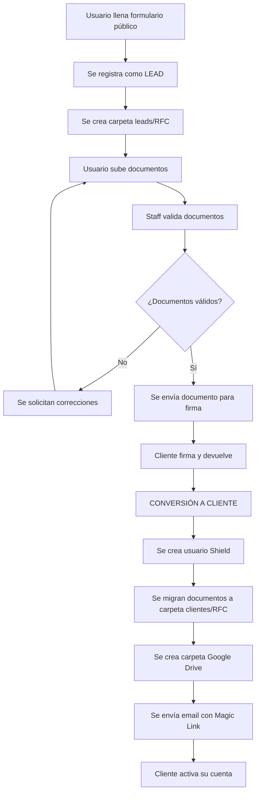

# 📋 FLUJO DE GENERACIÓN DE EXPEDIENTES ANVAR

## 🎯 OBJETIVO

Documentar el flujo completo de generación de expedientes digitales desde el registro inicial como **Lead** hasta la conversión en **Cliente** con cuenta de acceso activa.

---

## 🔄 FLUJO GENERAL



---

## 📝 ETAPAS DETALLADAS

### 1. REGISTRO INICIAL COMO LEAD

#### 📍 **Ubicación:** `http://localhost/registro-clientes`

#### 🔧 **Procesamiento:**
- **Controller:** `Public\RegistroClientesController::procesar()`
- **Service:** `ExpedientesLeadsService::procesarNuevoLead()`
- **Tabla:** `registro_leads`

#### 📊 **Datos Requeridos:**
```php
[
    'firstname' => 'Nombre',
    'lastname' => 'Apellido Paterno',
    'apellido_materno' => 'Apellido Materno',
    'rfc' => 'RFC (prioritario)',
    'curp' => 'CURP (alternativo)',
    'email' => 'Email único',
    'mobilephone' => 'WhatsApp',
    'desarrollo' => 'valle_natura|cordelia',
    // ... otros campos
]
```

#### 🗂️ **Resultado:**
- ✅ Lead registrado en `registro_leads`
- ✅ Carpeta creada: `public/uploads/leads/{RFC|CURP}/`
- ✅ Identificador de expediente asignado
- ✅ Estado inicial: `etapa_proceso = 'pendiente'`

---

### 2. SUBIDA DE DOCUMENTOS

#### 📁 **Nomenclatura de Archivos:**
```
leads/{RFC|CURP}/
├── ine_frontal_{RFC|CURP}.pdf
├── ine_trasera_{RFC|CURP}.pdf
├── comprobante_ingresos_{RFC|CURP}.pdf
├── comprobante_domicilio_{RFC|CURP}.pdf
├── acta_nacimiento_{RFC|CURP}.pdf
└── contrato_firmado_{RFC|CURP}.pdf
```

#### 🔧 **Procesamiento:**
- **Service:** `ExpedientesLeadsService::subirDocumentoLead()`
- **Validaciones:** Tamaño, tipo, extensión
- **Tabla:** `documentos_leads`

#### 📊 **Estados de Documento:**
- `upload_status`: `uploading` → `uploaded` → `failed`
- `estado_revision`: `pendiente` → `aceptado` → `rechazado`
- `validado`: `0` → `1`

---

### 3. VALIDACIÓN POR STAFF

#### 👥 **Acceso:** `/admin/leads`

#### 🔧 **Funcionalidades:**
- Visualizar documentos
- Aprobar/Rechazar con observaciones
- Cambiar etapa del proceso
- Solicitar documentos adicionales

#### 📊 **Estados de Etapa:**
1. `pendiente` - Recién registrado
2. `calificado` - Documentos iniciales aprobados
3. `enviar_documento_para_firma` - Listo para enviar contrato
4. `documento_enviado_para_firma` - Contrato enviado
5. `documento_recibido_firmado` - ✅ **LISTO PARA CONVERSIÓN**

---

### 4. CONVERSIÓN A CLIENTE

#### 🎯 **Trigger:** `etapa_proceso = 'documento_recibido_firmado'`

#### 🔧 **Procesamiento:**
- **Service:** `ExpedientesLeadsService::convertirLeadACliente()`

#### 📋 **Pasos de Conversión:**

##### A. **Crear Cliente**
```php
// Tabla: clientes
$datosCliente = $lead->toClienteData();
$clienteId = $clienteModel->insert($datosCliente);
```

##### B. **Crear Usuario Shield**
```php
// Tabla: users + auth_groups_users
$usuario = [
    'email' => $lead->email,
    'password' => $passwordTemporal,
    'active' => 1
];
$userId = $userModel->insert($usuario);
$userModel->addToGroup('cliente', $userId);
```

##### C. **Migrar Documentos**
```bash
# Copiar archivos físicos
cp -r public/uploads/leads/{RFC}/* public/uploads/clientes/{RFC}/

# Actualizar registros en base de datos
UPDATE documentos_leads SET migrado_a_cliente = 1 WHERE registro_lead_id = ?
```

##### D. **Crear Carpeta Google Drive**
```php
$googleDriveService->crearCarpeta("Cliente_{RFC}");
```

##### E. **Enviar Email con Magic Link**
```php
$magicLink = $this->generarMagicLink($userId, $email);
$this->enviarEmailBienvenidaCliente($email, $magicLink);
```

##### F. **Marcar Lead como Convertido**
```php
$leadModel->marcarComoConvertido($leadId, $clienteId);
```

---

## 🔐 SISTEMA DE MAGIC LINK

### 📧 **Email de Bienvenida**
- **Template:** `app/Views/emails/bienvenida_cliente.php`
- **Configuración SMTP:** `app/Config/Email.php`
- **Servidor:** `mail.anvarinmobiliaria.com:465 (SSL)`

### 🔗 **Estructura del Magic Link**
```
https://sistema.anvar.com/auth/magic-link?token={TOKEN}&email={EMAIL}&hash={HASH}
```

### ⏱️ **Expiración**
- **Tiempo de vida:** 24 horas
- **Uso único:** Se invalida después del primer uso

---

## 🗂️ ESTRUCTURA DE ARCHIVOS

### 📁 **Directorio de Uploads**
```
public/uploads/
├── leads/                          # Expedientes temporales
│   └── {RFC|CURP}/
│       ├── ine_frontal_{RFC}.pdf
│       ├── ine_trasera_{RFC}.pdf
│       └── ...
├── clientes/                       # Expedientes permanentes
│   └── {RFC|CURP}/
│       ├── ine_frontal_{RFC}.pdf
│       ├── ine_trasera_{RFC}.pdf
│       └── ...
└── temp/                          # Archivos temporales
```

### 🗄️ **Estructura de Base de Datos**

#### **Tabla: registro_leads**
```sql
-- Campos principales
id, firstname, lastname, apellido_materno
rfc, curp, identificador_expediente
email, mobilephone, desarrollo
etapa_proceso, convertido_a_cliente
fecha_conversion, cliente_id
-- Integración APIs
hubspot_sync_status, google_drive_sync_status
-- Metadatos
fecha_registro, activo
```

#### **Tabla: documentos_leads**
```sql
-- Relación y tipo
registro_lead_id, tipo_documento
-- Archivo
nombre_archivo_original, nombre_archivo_final
ruta_archivo_local, extension, tamano_bytes
-- Estados
upload_status, estado_revision, validado
migrado_a_cliente
-- Google Drive
google_drive_file_id, google_drive_url
```

---

## 🚨 CONSIDERACIONES DE SEGURIDAD

### 🔒 **Protección de Archivos**
- Archivos fuera del DocumentRoot web
- Validación estricta de tipos de archivo
- Límites de tamaño por archivo (10MB máximo)
- Nombres de archivo sanitizados

### 🛡️ **Autenticación**
- Contraseñas generadas aleatoriamente
- Magic Links con tokens únicos
- Expiración automática de enlaces
- Grupos de usuarios con permisos específicos

### 📊 **Auditoría**
- Log de todas las acciones críticas
- Historial de cambios en documentos
- Rastreo de accesos y descargas
- Backup automático de expedientes

---

## 🔧 CONFIGURACIÓN TÉCNICA

### ⚙️ **Variables de Entorno**
```env
# Email SMTP
SMTP_HOST=mail.anvarinmobiliaria.com
SMTP_PORT=465
SMTP_USER=noreply@anvarinmobiliaria.com
SMTP_PASS=P[*+;[=m&4Vs]
SMTP_CRYPTO=ssl

# Google Drive API
GOOGLE_DRIVE_CLIENT_ID=...
GOOGLE_DRIVE_CLIENT_SECRET=...
GOOGLE_DRIVE_REFRESH_TOKEN=...

# HubSpot API
HUBSPOT_API_KEY=...
HUBSPOT_OWNER_ID=80110028
```

### 🗄️ **Permisos de Archivos**
```bash
# Directorio de uploads
chmod 755 public/uploads/
chmod 755 public/uploads/leads/
chmod 755 public/uploads/clientes/

# Archivos individuales
chmod 644 public/uploads/**/*.pdf
chmod 644 public/uploads/**/*.jpg
```

---

## 📊 MÉTRICAS Y MONITOREO

### 📈 **KPIs del Sistema**
- **Tasa de Conversión:** Leads → Clientes
- **Tiempo Promedio:** Registro → Conversión
- **Documentos Pendientes:** Por validar
- **Errores de Sincronización:** APIs externas

### 🔍 **Monitoreo Automático**
- **Logs de Sistema:** `/writable/logs/`
- **Alertas por Email:** Errores críticos
- **Dashboard Admin:** Métricas en tiempo real
- **Reportes Semanales:** Estado general

---

## 🚀 COMANDOS ÚTILES

### 🔧 **Mantenimiento**
```bash
# Limpiar documentos huérfanos
php spark cleanup:documentos-huerfanos

# Verificar integridad de expedientes
php spark verificar:expedientes

# Sincronizar con Google Drive
php spark sync:google-drive

# Reenviar emails fallidos
php spark reenviar:emails-pendientes
```

### 📊 **Estadísticas**
```bash
# Reporte de conversiones
php spark reporte:conversiones --mes=2025-01

# Documentos pendientes de validación
php spark reporte:documentos-pendientes

# Estado de sincronización APIs
php spark reporte:sync-status
```

---

## 🔄 FLUJO DE DATOS - RESUMEN TÉCNICO

```php
// 1. Registro Lead
$leadData = $_POST; // Formulario público
$leadId = $expedientesService->procesarNuevoLead($leadData);

// 2. Subir Documentos
foreach ($_FILES as $tipo => $archivo) {
    $expedientesService->subirDocumentoLead($leadId, $archivo, $tipo);
}

// 3. Validación Staff (Manual)
$documentoModel->validarDocumento($docId, $staffId, true, $observaciones);
$leadModel->cambiarEtapa($leadId, 'documento_recibido_firmado');

// 4. Conversión a Cliente (Automática)
if ($lead->puedeConvertirseACliente()) {
    $resultado = $expedientesService->convertirLeadACliente($leadId);
    
    // Cliente creado + Usuario Shield + Documentos migrados + Email enviado
}
```

---

## 🎯 PRÓXIMOS DESARROLLOS

### 🔮 **Funcionalidades Futuras**
- [ ] Firma digital integrada
- [ ] Notificaciones push en tiempo real
- [ ] Dashboard cliente con progreso visual
- [ ] Integración con DocuSign
- [ ] API REST para terceros
- [ ] App móvil para clientes

### 🚀 **Optimizaciones Técnicas**
- [ ] Cache Redis para documentos frecuentes
- [ ] CDN para archivos estáticos
- [ ] Compresión automática de PDFs
- [ ] Backup incremental automatizado
- [ ] Análisis de performance con APM

---

**📅 Última actualización:** <?= date('Y-m-d H:i:s') ?>  
**👨‍💻 Desarrollado por:** Equipo ANVAR Tech  
**📧 Soporte técnico:** dev@anvarinmobiliaria.com