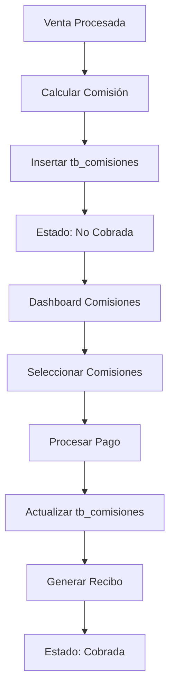

# MIGRACIÓN MÓDULO COMISIONES - ANVAR INMOBILIARIA

**Análisis completo del sistema de comisiones legacy para migración a CodeIgniter 4**

---

## 📋 RESUMEN EJECUTIVO

El módulo de comisiones del sistema legacy de ANVAR es uno de los componentes más críticos y complejos del sistema, ya que maneja toda la lógica de compensación económica para vendedores, gerentes y agentes. Este módulo está profundamente integrado con el proceso de ventas y cobranza, por lo que su migración requiere especial atención para preservar la integridad financiera.

### Características Clave del Módulo Legacy
- **Sistema multi-rol**: Calcula comisiones para vendedores, super vendedores y agentes independientes  
- **Múltiples tipos de comisión**: Porcentaje sobre venta, comisión fija, comisión por apartado
- **Estados de cobro**: Comisiones pendientes vs. cobradas con registro completo de pagos
- **Integración completa**: Con ventas, pagos, usuarios y proyectos
- **Reportes especializados**: Por vendedor, período, proyecto y estado

---

## 🏗️ ANÁLISIS DEL SISTEMA LEGACY

### Estructura de Archivos Identificados

```
administracion/
├── comisiones.php                    # 🎯 PRINCIPAL - Dashboard comisiones admin
├── vendedor_comisiones.php          # 👤 Vista vendedores para comisiones  
├── super_vendedor_comisiones.php    # 👑 Vista super vendedores
├── reporte_comisiones.php           # 📊 Reportes de comisiones
├── ver_recibo_comision*.php         # 🧾 Generación de recibos
└── comandos/
    ├── funciones.php                 # 🧠 LÓGICA CENTRAL (funciones 48-54)
    └── vendedor_comisiones.php       # 🔧 Funciones específicas vendedor
```

### Funciones Core Identificadas en funciones.php

```php
// FUNCIONES PRINCIPALES DE COMISIONES
function 48 → buscar_comisiones()      // Búsqueda avanzada con filtros
function 49 → obtener_comision()      // Datos de comisión específica  
function 50 → verificar_saldo()       // Verificar saldo pendiente
function 51 → pagar_comision()        // Procesar pago individual
function 52 → pagar_comisiones()      // Procesar múltiples pagos
function 53 → cambiar_vendedor()      // Reasignar comisión a vendedor
function 54 → modificar_total()       // Ajustar monto de comisión
```

---

## 🗄️ ESTRUCTURA DE BASE DE DATOS LEGACY

### Tabla Principal: `tb_comisiones`

```sql
CREATE TABLE `tb_comisiones` (
  `IdComision` int(11) NOT NULL AUTO_INCREMENT,
  `Total` double DEFAULT '0',                    -- Monto total de comisión
  `TotalPagado` double DEFAULT '0',              -- Monto ya pagado
  `Fecha` date DEFAULT NULL,                     -- Fecha de generación
  `Hora` time DEFAULT NULL,                      -- Hora de generación
  `Vendedor` int(11) DEFAULT '0',                -- ID del vendedor
  `NVendedor` varchar(1000) DEFAULT NULL,        -- ❌ DESNORMALIZADO
  `Proyecto` int(11) DEFAULT '0',                -- ID del proyecto
  `NProyecto` varchar(1000) DEFAULT NULL,        -- ❌ DESNORMALIZADO
  `Lote` int(11) DEFAULT '0',                    -- ID del lote vendido
  `NLote` varchar(1000) DEFAULT NULL,            -- ❌ DESNORMALIZADO
  `Manzana` int(11) DEFAULT '0',                 -- ID de la manzana
  `NManzana` varchar(1000) DEFAULT NULL,         -- ❌ DESNORMALIZADO
  `Venta` int(11) DEFAULT '0',                   -- ID de la venta asociada
  `Estatus` int(11) DEFAULT '0',                 -- Estado del registro
  `Cobrada` tinyint(4) DEFAULT '0',              -- Si ya fue cobrada
  `FechaPago` date DEFAULT NULL,                 -- Fecha del pago
  `HoraPago` time DEFAULT NULL,                  -- Hora del pago
  `Ingreso` int(11) DEFAULT '0',                 -- ID del registro de ingreso
  `Empresa` int(11) DEFAULT '0',                 -- ID de la empresa
  `NEmpresa` varchar(1000) DEFAULT NULL,         -- ❌ DESNORMALIZADO
  `Observaciones` varchar(2000) DEFAULT NULL,   -- Notas adicionales
  `SubComision` tinyint(4) DEFAULT '0',          -- Si es sub-comisión
  `SubVendedor` int(11) DEFAULT '0',             -- Sub-vendedor asignado
  `NSubVendedor` varchar(1000) DEFAULT NULL,     -- ❌ DESNORMALIZADO
  PRIMARY KEY (`IdComision`)
) ENGINE=InnoDB DEFAULT CHARSET=utf8 COLLATE=utf8_unicode_ci;
```

### Configuración de Comisiones: `tb_configuracion`

```sql
-- CAMPOS RELEVANTES PARA COMISIONES
PorcentajeComision   double DEFAULT '0'    -- % de comisión sobre venta
ApartadoComision     double DEFAULT '0'    -- Comisión por apartado
TipoComision         int(11) DEFAULT '0'   -- 1=Porcentaje, 2=Fijo
ComisionFija         double DEFAULT '0'    -- Monto fijo de comisión
FolioComision        int(11) DEFAULT '0'   -- Folio para recibos
```

### Configuración por Usuario: `tb_usuarios`

```sql
-- CAMPOS ESPECÍFICOS DE COMISIONES EN USUARIOS
TipoComision         int(11) DEFAULT '0'   -- Tipo específico por vendedor
ComisionFija         double DEFAULT '0'    -- Comisión fija personal
PorcentajeComision   double DEFAULT '0'    -- % personal de comisión
Comisiones           tinyint(4) DEFAULT '0' -- Permiso módulo comisiones
ReporteComisiones    tinyint(4) DEFAULT '0' -- Permiso reportes
```

---

## 🔄 FLUJO DE PROCESOS DE COMISIONES

### Flujo Principal: Venta → Comisión → Pago



### Algoritmo de Cálculo de Comisiones

```php
// LÓGICA LEGACY IDENTIFICADA EN funciones.php líneas 2554-2582
if($configuracion["TipoComision"] == 1) {
    // TIPO 1: Porcentaje sobre venta
    $comision = ($venta["Total"] * $configuracion["PorcentajeComision"]) / 100;
    
} elseif($configuracion["TipoComision"] == 2) {
    // TIPO 2: Comisión fija
    $comision = $configuracion["ComisionFija"];
}

// COMISIÓN POR APARTADO (adicional)
$comision_apartado = $configuracion["ApartadoComision"];

// INSERTAR EN tb_comisiones
mysqli_query($link, "INSERT INTO tb_comisiones SET 
    Total = $comision,
    Fecha = '$fecha',
    Hora = '$hora',
    Vendedor = $vendedor_id,
    NVendedor = '$vendedor_nombre',     -- ❌ DESNORMALIZACIÓN
    Proyecto = $proyecto_id,
    NProyecto = '$proyecto_nombre',     -- ❌ DESNORMALIZACIÓN  
    Lote = $lote_id,
    NLote = '$lote_clave',              -- ❌ DESNORMALIZACIÓN
    Venta = $venta_id,
    Empresa = $empresa_id,
    Estatus = 1,
    Cobrada = 0
");
```

### Proceso de Pago de Comisiones

```php
// FUNCIÓN 51: pagar_comision() - Línea ~5877 funciones.php
// 1. Validar permisos y existencia
// 2. Obtener datos de comisión
// 3. Calcular saldo pendiente
// 4. Procesar pago (efectivo/transferencia/cheque)
// 5. Actualizar tb_comisiones 
// 6. Generar registro en tb_ingresos
// 7. Generar recibo de pago
```

---

## 👥 TIPOS DE USUARIO Y PERMISOS

### Jerarquía de Usuarios Identificada

```php
// TIPOS DE USUARIO CON ACCESO A COMISIONES
Tipo 1: Administrador     → Acceso completo a todas las comisiones
Tipo 3: Gerente          → Acceso a comisiones de su equipo
Tipo 2: Vendedor         → Solo sus propias comisiones  
Tipo 4: Super Vendedor   → Sus comisiones + equipo asignado
Tipo 5: Agente Indep.    → Solo sus comisiones
```

### Permisos Granulares

```php
// EN tb_usuarios - PERMISOS ESPECÍFICOS
$_SESSION["ANV_U_LOG_P_COMISIONES"]    = 1;  // Ver módulo comisiones
$_SESSION["ANV_U_LOG_P_RCOMISIONES"]   = 1;  // Reportes comisiones

// FILTROS POR EMPRESA (multi-tenant)
$_SESSION["ANV_U_LOG_P_EMPRESAS"]      = " AND empresa_id IN (1,2,3)";
```

---

## 🧮 LÓGICA DE NEGOCIO CRÍTICA

### Tipos de Comisión Identificados

#### 1. **Comisión Principal** (sobre venta cerrada)
```php
// Configuración por proyecto en tb_configuracion
TipoComision = 1 → Porcentaje sobre total de venta
TipoComision = 2 → Monto fijo por venta

// Configuración personal en tb_usuarios  
// Puede sobreescribir la configuración del proyecto
```

#### 2. **Comisión por Apartado** (al reservar lote)
```php
// Se genera inmediatamente al hacer apartado
// Monto fijo definido en tb_configuracion.ApartadoComision
// Independiente de si la venta se concreta
```

#### 3. **Sub-comisiones** (para equipos)
```php
// Campo SubComision = 1 en tb_comisiones
// SubVendedor apunta al líder del equipo
// Permite estructura jerárquica de comisiones
```

### Reglas de Negocio Críticas

1. **Una comisión por venta**: Relación 1:1 entre venta y comisión principal
2. **Estados mutuamente excluyentes**: Cobrada=0 (pendiente) vs Cobrada=1 (pagada)
3. **Pagos parciales**: TotalPagado puede ser menor a Total
4. **Trazabilidad completa**: Cada pago genera registro en tb_ingresos
5. **Multi-empresa**: Comisiones filtradas por empresa del usuario

---

## ⚠️ PROBLEMAS IDENTIFICADOS EN SISTEMA LEGACY

### 🔴 Críticos - Integridad de Datos

```sql
-- ❌ PROBLEMA: Desnormalización extrema
NVendedor, NProyecto, NLote, NManzana, NEmpresa, NSubVendedor
-- Si cambia el nombre del vendedor, queda inconsistente en comisiones históricas

-- ❌ PROBLEMA: Sin foreign keys
Vendedor, Proyecto, Lote, Manzana, Venta, Empresa, SubVendedor
-- No hay integridad referencial, permite datos huérfanos
```

### 🟠 Altos - Seguridad y Arquitectura

```php
// ❌ PROBLEMA: SQL Injection en funciones.php
$vendedor = $_POST['vendedor'];
$query = "SELECT * FROM tb_comisiones WHERE Vendedor = $vendedor";
// Sin validación ni parámetros preparados

// ❌ PROBLEMA: Lógica dispersa
// Cálculo de comisiones en múltiples lugares
// Difícil mantenimiento y testing
```

### 🟡 Medios - Performance y Mantenibilidad

```php
// ❌ PROBLEMA: Queries N+1 en reportes
foreach($vendedores as $vendedor) {
    $comisiones = query("SELECT * FROM tb_comisiones WHERE Vendedor = $vendedor[id]");
    // Una query por vendedor en lugar de JOIN
}

// ❌ PROBLEMA: Sin paginación en listados grandes
// Carga todas las comisiones en memoria sin límites
```

---

## 💡 FORTALEZAS DEL SISTEMA LEGACY

### ✅ Lógica de Negocio Robusta

1. **Cálculos Financieros Probados**: Algoritmos de comisión están bien testados en producción
2. **Manejo de Estados Completo**: Control preciso de comisiones pendientes vs pagadas  
3. **Trazabilidad Total**: Cada pago queda registrado con fecha, hora, forma de pago
4. **Flexibilidad de Configuración**: Permite tanto % como montos fijos por proyecto/vendedor
5. **Sub-comisiones**: Sistema de comisiones jerárquicas para equipos de venta

### ✅ Funcionalidades Avanzadas

1. **Reportes Especializados**: Comisiones por vendedor, período, proyecto, estado
2. **Pagos Múltiples**: Permite pagar varias comisiones en lote
3. **Pagos Parciales**: Manejo de abonos a comisiones grandes
4. **Multi-empresa**: Filtrado automático por empresa del usuario
5. **Generación de Recibos**: PDFs automáticos para cada pago

---

## 🎯 PLAN DE MIGRACIÓN A CODEIGNITER 4

### Fase 1: Diseño de Arquitectura Entity-First

#### 1.1 Entity Principal
```php
// app/Entities/Comision.php
class Comision extends Entity
{
    protected $attributes = [
        'id' => null,
        'total' => 0.0,
        'total_pagado' => 0.0,
        'fecha_generacion' => null,
        'vendedor_id' => null,
        'venta_id' => null,
        'proyecto_id' => null,
        'lote_id' => null,
        'estado' => 'pendiente', // pendiente, pagada, cancelada
        'fecha_pago' => null,
        'observaciones' => null,
        'tipo' => 'principal', // principal, apartado, sub_comision
        'created_at' => null,
        'updated_at' => null,
    ];
    
    protected $casts = [
        'total' => 'float',
        'total_pagado' => 'float',
        'fecha_generacion' => 'datetime',
        'fecha_pago' => 'datetime',
    ];
    
    // MÉTODOS DE NEGOCIO
    public function getSaldoPendiente(): float
    {
        return $this->total - $this->total_pagado;
    }
    
    public function estaCompleta(): bool
    {
        return $this->total_pagado >= $this->total;
    }
    
    public function puedeSerCobrada(): bool
    {
        return $this->estado === 'pendiente' && $this->getSaldoPendiente() > 0;
    }
}
```

#### 1.2 Entities Relacionadas
```php
// app/Entities/PagoComision.php
class PagoComision extends Entity
{
    protected $attributes = [
        'id' => null,
        'comision_id' => null,
        'monto' => 0.0,
        'forma_pago' => null, // efectivo, transferencia, cheque
        'referencia' => null,
        'fecha_pago' => null,
        'cuenta_bancaria_id' => null,
        'usuario_registro_id' => null,
        'created_at' => null,
    ];
}

// app/Entities/ConfiguracionComision.php  
class ConfiguracionComision extends Entity
{
    protected $attributes = [
        'id' => null,
        'empresa_id' => null,
        'proyecto_id' => null,
        'tipo_comision' => 'porcentaje', // porcentaje, fijo
        'porcentaje' => 0.0,
        'monto_fijo' => 0.0,
        'comision_apartado' => 0.0,
        'activo' => true,
    ];
    
    public function calcularComision(float $montoVenta): float
    {
        if ($this->tipo_comision === 'porcentaje') {
            return ($montoVenta * $this->porcentaje) / 100;
        }
        
        return $this->monto_fijo;
    }
}
```

### Fase 2: Models con Relaciones Explícitas

#### 2.1 Model Principal
```php
// app/Models/ComisionModel.php
class ComisionModel extends Model
{
    protected $table = 'comisiones';
    protected $primaryKey = 'id';
    protected $returnType = Comision::class;
    protected $allowedFields = [
        'total', 'total_pagado', 'fecha_generacion',
        'vendedor_id', 'venta_id', 'proyecto_id', 'lote_id',
        'estado', 'fecha_pago', 'observaciones', 'tipo'
    ];
    
    // RELACIONES
    public function getComisionesPorVendedor(int $vendedorId, array $filtros = []): array
    {
        $builder = $this->builder()
            ->select('comisiones.*, staff.nombre as vendedor_nombre')
            ->select('ventas.folio_interno, proyectos.nombre as proyecto_nombre')
            ->join('staff', 'staff.id = comisiones.vendedor_id')
            ->join('ventas', 'ventas.id = comisiones.venta_id')
            ->join('proyectos', 'proyectos.id = comisiones.proyecto_id')
            ->where('comisiones.vendedor_id', $vendedorId);
            
        // Aplicar filtros
        if (!empty($filtros['estado'])) {
            $builder->where('comisiones.estado', $filtros['estado']);
        }
        
        if (!empty($filtros['fecha_inicio'])) {
            $builder->where('comisiones.fecha_generacion >=', $filtros['fecha_inicio']);
        }
        
        return $builder->findAll();
    }
    
    public function getComisionesPendientes(int $empresaId): array
    {
        return $this->builder()
            ->select('comisiones.*, staff.nombre as vendedor_nombre')
            ->join('staff', 'staff.id = comisiones.vendedor_id')
            ->join('proyectos', 'proyectos.id = comisiones.proyecto_id')
            ->where('comisiones.estado', 'pendiente')
            ->where('proyectos.empresa_id', $empresaId)
            ->orderBy('comisiones.fecha_generacion', 'DESC')
            ->findAll();
    }
}
```

#### 2.2 Service para Lógica de Negocio
```php
// app/Services/ComisionService.php
class ComisionService
{
    protected ComisionModel $comisionModel;
    protected ConfiguracionComisionModel $configuracionModel;
    protected PagoComisionModel $pagoModel;
    
    public function generarComisionPorVenta(Venta $venta): Comision
    {
        // 1. Obtener configuración de comisión
        $configuracion = $this->configuracionModel
            ->where('empresa_id', $venta->empresa_id)
            ->where('proyecto_id', $venta->proyecto_id)
            ->first();
            
        if (!$configuracion) {
            throw new ComisionException('No hay configuración de comisión para este proyecto');
        }
        
        // 2. Calcular monto de comisión
        $montoComision = $configuracion->calcularComision($venta->total);
        
        // 3. Crear entidad de comisión
        $comision = new Comision([
            'total' => $montoComision,
            'fecha_generacion' => Time::now(),
            'vendedor_id' => $venta->vendedor_id,
            'venta_id' => $venta->id,
            'proyecto_id' => $venta->proyecto_id,
            'lote_id' => $venta->propiedad_id,
            'estado' => 'pendiente',
            'tipo' => 'principal'
        ]);
        
        // 4. Guardar en base de datos
        $this->comisionModel->save($comision);
        
        return $comision;
    }
    
    public function procesarPago(Comision $comision, array $datosPago): PagoComision
    {
        if (!$comision->puedeSerCobrada()) {
            throw new ComisionException('Esta comisión no puede ser cobrada');
        }
        
        $pago = new PagoComision([
            'comision_id' => $comision->id,
            'monto' => $datosPago['monto'],
            'forma_pago' => $datosPago['forma_pago'],
            'referencia' => $datosPago['referencia'] ?? null,
            'fecha_pago' => Time::now(),
            'cuenta_bancaria_id' => $datosPago['cuenta_bancaria_id'] ?? null,
            'usuario_registro_id' => auth()->id(),
        ]);
        
        // Usar transacción para atomicidad
        $this->comisionModel->db->transStart();
        
        try {
            // Guardar pago
            $this->pagoModel->save($pago);
            
            // Actualizar comisión
            $comision->total_pagado += $datosPago['monto'];
            
            if ($comision->estaCompleta()) {
                $comision->estado = 'pagada';
                $comision->fecha_pago = Time::now();
            }
            
            $this->comisionModel->save($comision);
            
            $this->comisionModel->db->transComplete();
            
            if ($this->comisionModel->db->transStatus() === false) {
                throw new ComisionException('Error al procesar el pago');
            }
            
            return $pago;
            
        } catch (Exception $e) {
            $this->comisionModel->db->transRollback();
            throw $e;
        }
    }
}
```

### Fase 3: Controllers con Arquitectura RESTful

#### 3.1 Controller Principal
```php
// app/Controllers/Admin/AdminComisionesController.php
class AdminComisionesController extends BaseController
{
    protected ComisionService $comisionService;
    protected ComisionModel $comisionModel;
    
    public function index()
    {
        // Verificar permisos
        if (!auth()->user()->can('comisiones.ver')) {
            throw new ForbiddenException('No tienes permisos para ver comisiones');
        }
        
        return view('admin/comisiones/index', [
            'title' => 'Gestión de Comisiones',
            'breadcrumbs' => [
                ['title' => 'Dashboard', 'url' => route_to('admin.dashboard')],
                ['title' => 'Comisiones', 'url' => null]
            ]
        ]);
    }
    
    public function buscar()
    {
        // Validar entrada
        $rules = [
            'vendedor_id' => 'permit_empty|is_natural',
            'proyecto_id' => 'permit_empty|is_natural',
            'estado' => 'permit_empty|in_list[pendiente,pagada,cancelada]',
            'fecha_inicio' => 'permit_empty|valid_date',
            'fecha_fin' => 'permit_empty|valid_date',
        ];
        
        if (!$this->validate($rules)) {
            return $this->response->setJSON([
                'success' => false,
                'errors' => $this->validator->getErrors()
            ]);
        }
        
        $filtros = $this->request->getPost();
        
        // Aplicar filtro de empresa automáticamente
        $empresaIds = auth()->user()->getEmpresasPermitidas();
        
        $comisiones = $this->comisionModel->getComisionesFiltradas($filtros, $empresaIds);
        
        return $this->response->setJSON([
            'success' => true,
            'data' => $comisiones
        ]);
    }
    
    public function pagar($comisionId)
    {
        try {
            $comision = $this->comisionModel->find($comisionId);
            
            if (!$comision) {
                throw new NotFoundException('Comisión no encontrada');
            }
            
            // Validar datos de pago
            $rules = [
                'monto' => 'required|decimal|greater_than[0]',
                'forma_pago' => 'required|in_list[efectivo,transferencia,cheque]',
                'cuenta_bancaria_id' => 'permit_empty|is_natural',
                'referencia' => 'permit_empty|max_length[255]',
            ];
            
            if (!$this->validate($rules)) {
                return $this->response->setJSON([
                    'success' => false,
                    'errors' => $this->validator->getErrors()
                ]);
            }
            
            $datosPago = $this->request->getPost();
            
            $pago = $this->comisionService->procesarPago($comision, $datosPago);
            
            return $this->response->setJSON([
                'success' => true,
                'message' => 'Pago procesado exitosamente',
                'data' => ['pago_id' => $pago->id]
            ]);
            
        } catch (Exception $e) {
            log_message('error', 'Error al procesar pago de comisión: ' . $e->getMessage());
            
            return $this->response->setJSON([
                'success' => false,
                'message' => 'Error al procesar el pago: ' . $e->getMessage()
            ]);
        }
    }
}
```

### Fase 4: Helpers Especializados

#### 4.1 Helper de Comisiones
```php
// app/Helpers/comision_helper.php
if (!function_exists('formatear_estado_comision')) {
    function formatear_estado_comision(string $estado): string
    {
        $estados = [
            'pendiente' => '<span class="badge badge-warning">Pendiente</span>',
            'pagada' => '<span class="badge badge-success">Pagada</span>',
            'cancelada' => '<span class="badge badge-danger">Cancelada</span>',
        ];
        
        return $estados[$estado] ?? '<span class="badge badge-secondary">Desconocido</span>';
    }
}

if (!function_exists('calcular_total_comisiones')) {
    function calcular_total_comisiones(array $comisiones, string $campo = 'total'): float
    {
        return array_reduce($comisiones, function ($total, $comision) use ($campo) {
            return $total + ($comision->$campo ?? 0);
        }, 0.0);
    }
}

if (!function_exists('generar_folio_comision')) {
    function generar_folio_comision(): string
    {
        $configuracion = model(ConfiguracionEmpresaModel::class)
            ->where('empresa_id', session('empresa_id'))
            ->first();
            
        $siguiente = $configuracion->folio_comision + 1;
        
        // Actualizar folio
        model(ConfiguracionEmpresaModel::class)->update($configuracion->id, [
            'folio_comision' => $siguiente
        ]);
        
        return sprintf('COM-%04d', $siguiente);
    }
}
```

### Fase 5: Vistas con Arquitectura Modular

#### 5.1 Vista Principal
```php
<!-- app/Views/admin/comisiones/index.php -->
<?= $this->extend('layouts/admin') ?>

<?= $this->section('content') ?>
<div class="container-fluid">
    <div class="d-sm-flex align-items-center justify-content-between mb-4">
        <h1 class="h3 mb-0 text-gray-800">Gestión de Comisiones</h1>
        <button class="btn btn-primary" id="btn-pagar-multiples">
            <i class="fas fa-hand-holding-usd"></i> Pagar Seleccionadas
        </button>
    </div>

    <!-- Filtros de Búsqueda -->
    <div class="card shadow mb-4">
        <div class="card-header py-3">
            <h6 class="m-0 font-weight-bold text-primary">Filtros de Búsqueda</h6>
        </div>
        <div class="card-body">
            <?= form_open('', ['id' => 'form-filtros']) ?>
                <div class="row">
                    <div class="col-md-3">
                        <label for="vendedor_id">Vendedor:</label>
                        <select name="vendedor_id" id="vendedor_id" class="form-control select2">
                            <option value="">Todos los vendedores</option>
                            <?php foreach ($vendedores as $vendedor): ?>
                                <option value="<?= $vendedor->id ?>"><?= esc($vendedor->nombre) ?></option>
                            <?php endforeach; ?>
                        </select>
                    </div>
                    
                    <div class="col-md-3">
                        <label for="proyecto_id">Proyecto:</label>
                        <select name="proyecto_id" id="proyecto_id" class="form-control select2">
                            <option value="">Todos los proyectos</option>
                            <?php foreach ($proyectos as $proyecto): ?>
                                <option value="<?= $proyecto->id ?>"><?= esc($proyecto->nombre) ?></option>
                            <?php endforeach; ?>
                        </select>
                    </div>
                    
                    <div class="col-md-2">
                        <label for="estado">Estado:</label>
                        <select name="estado" id="estado" class="form-control">
                            <option value="">Todos</option>
                            <option value="pendiente">Pendientes</option>
                            <option value="pagada">Pagadas</option>
                        </select>
                    </div>
                    
                    <div class="col-md-2">
                        <label for="fecha_inicio">Fecha Inicio:</label>
                        <input type="date" name="fecha_inicio" id="fecha_inicio" class="form-control">
                    </div>
                    
                    <div class="col-md-2">
                        <label for="fecha_fin">Fecha Fin:</label>
                        <input type="date" name="fecha_fin" id="fecha_fin" class="form-control">
                    </div>
                </div>
                
                <div class="row mt-3">
                    <div class="col-12">
                        <button type="submit" class="btn btn-primary">
                            <i class="fas fa-search"></i> Buscar
                        </button>
                        <button type="reset" class="btn btn-secondary">
                            <i class="fas fa-eraser"></i> Limpiar
                        </button>
                    </div>
                </div>
            <?= form_close() ?>
        </div>
    </div>

    <!-- Tabla de Resultados -->
    <div class="card shadow mb-4">
        <div class="card-header py-3">
            <h6 class="m-0 font-weight-bold text-primary">Comisiones</h6>
        </div>
        <div class="card-body">
            <div class="table-responsive">
                <table class="table table-bordered" id="tabla-comisiones">
                    <thead>
                        <tr>
                            <th><input type="checkbox" id="select-all"></th>
                            <th>Folio</th>
                            <th>Vendedor</th>
                            <th>Proyecto</th>
                            <th>Lote</th>
                            <th>Fecha</th>
                            <th>Total</th>
                            <th>Pagado</th>
                            <th>Pendiente</th>
                            <th>Estado</th>
                            <th>Acciones</th>
                        </tr>
                    </thead>
                    <tbody id="tbody-comisiones">
                        <!-- Datos cargados vía AJAX -->
                    </tbody>
                </table>
            </div>
        </div>
    </div>
</div>

<!-- Modal Pago Individual -->
<?= $this->include('admin/comisiones/modals/pago_individual') ?>

<!-- Modal Pago Múltiple -->
<?= $this->include('admin/comisiones/modals/pago_multiple') ?>

<?= $this->endSection() ?>

<?= $this->section('scripts') ?>
<script src="<?= base_url('assets/js/admin/comisiones.js') ?>"></script>
<?= $this->endSection() ?>
```

---

## 🗂️ ESTRUCTURA DE MIGRACIÓN DE DATOS

### Mapeo de Campos Legacy → CI4

```sql
-- TABLA PRINCIPAL: tb_comisiones → comisiones
IdComision          → id
Total               → total  
TotalPagado         → total_pagado
Fecha + Hora        → fecha_generacion (datetime)
Vendedor            → vendedor_id (FK a staff)
Venta               → venta_id (FK a ventas)
Proyecto            → proyecto_id (FK a proyectos)  
Lote                → propiedad_id (FK a propiedades)
Estatus             → activo (boolean)
Cobrada             → estado ('pendiente'|'pagada')
FechaPago + HoraPago → fecha_pago (datetime)
Observaciones       → observaciones

-- CAMPOS DESNORMALIZADOS (ELIMINAR):
NVendedor, NProyecto, NLote, NManzana, NEmpresa, NSubVendedor
-- Estos se obtienen via JOINs en CI4

-- NUEVOS CAMPOS EN CI4:
tipo               ENUM('principal', 'apartado', 'sub_comision')
created_at         DATETIME
updated_at         DATETIME
```

### Script de Migración

```sql
-- 1. CREAR NUEVA ESTRUCTURA
CREATE TABLE comisiones (
    id INT PRIMARY KEY AUTO_INCREMENT,
    total DECIMAL(10,2) NOT NULL DEFAULT 0,
    total_pagado DECIMAL(10,2) NOT NULL DEFAULT 0,
    fecha_generacion DATETIME NOT NULL,
    vendedor_id INT NOT NULL,
    venta_id INT NOT NULL,
    proyecto_id INT NOT NULL,
    propiedad_id INT NOT NULL,
    estado ENUM('pendiente', 'pagada', 'cancelada') DEFAULT 'pendiente',
    fecha_pago DATETIME NULL,
    observaciones TEXT NULL,
    tipo ENUM('principal', 'apartado', 'sub_comision') DEFAULT 'principal',
    activo BOOLEAN DEFAULT TRUE,
    created_at DATETIME DEFAULT CURRENT_TIMESTAMP,
    updated_at DATETIME DEFAULT CURRENT_TIMESTAMP ON UPDATE CURRENT_TIMESTAMP,
    
    FOREIGN KEY (vendedor_id) REFERENCES staff(id),
    FOREIGN KEY (venta_id) REFERENCES ventas(id),
    FOREIGN KEY (proyecto_id) REFERENCES proyectos(id),
    FOREIGN KEY (propiedad_id) REFERENCES propiedades(id),
    
    INDEX idx_vendedor (vendedor_id),
    INDEX idx_venta (venta_id),
    INDEX idx_estado (estado),
    INDEX idx_fecha (fecha_generacion)
);

-- 2. MIGRAR DATOS LEGACY
INSERT INTO comisiones (
    total, total_pagado, fecha_generacion, vendedor_id, venta_id, 
    proyecto_id, propiedad_id, estado, fecha_pago, observaciones, activo
)
SELECT 
    tc.Total,
    tc.TotalPagado,
    CONCAT(tc.Fecha, ' ', COALESCE(tc.Hora, '00:00:00')),
    tc.Vendedor,
    tc.Venta,
    tc.Proyecto,
    tc.Lote,
    CASE 
        WHEN tc.Cobrada = 1 THEN 'pagada'
        ELSE 'pendiente'
    END,
    CASE 
        WHEN tc.FechaPago IS NOT NULL 
        THEN CONCAT(tc.FechaPago, ' ', COALESCE(tc.HoraPago, '00:00:00'))
        ELSE NULL
    END,
    tc.Observaciones,
    CASE WHEN tc.Estatus = 1 THEN TRUE ELSE FALSE END
FROM tb_comisiones tc
WHERE tc.Estatus = 1  -- Solo registros activos
ORDER BY tc.IdComision;
```

---

## 🚀 PLAN DE IMPLEMENTACIÓN

### Sprint 1: Infraestructura Base (1 semana)
- [ ] Crear Entities (Comision, PagoComision, ConfiguracionComision)
- [ ] Crear Models con relaciones FK
- [ ] Implementar ComisionService básico
- [ ] Crear migraciones de BD
- [ ] Testing unitario de entities

### Sprint 2: Lógica de Negocio Core (2 semanas)
- [ ] Implementar algoritmos de cálculo de comisión
- [ ] Proceso de generación automática en ventas
- [ ] Sistema de pagos individuales
- [ ] Sistema de pagos múltiples
- [ ] Testing de procesos críticos

### Sprint 3: Interfaces de Usuario (2 semanas)
- [ ] Controller AdminComisionesController
- [ ] Vistas de gestión de comisiones
- [ ] AJAX para búsquedas y filtros
- [ ] Modales de pago
- [ ] Integración con permisos Shield

### Sprint 4: Reportes y Migraciones (1 semana)
- [ ] Sistema de reportes de comisiones
- [ ] Exportación Excel/PDF
- [ ] Script de migración de datos legacy
- [ ] Validación de integridad post-migración
- [ ] Documentación de usuario

### Sprint 5: Testing y Refinamiento (1 semana)
- [ ] Testing end-to-end
- [ ] Performance testing
- [ ] Corrección de bugs
- [ ] Capacitación a usuarios
- [ ] Deploy a producción

---

## 🧪 ESTRATEGIA DE TESTING

### Testing de Lógica de Negocio
```php
// tests/unit/Services/ComisionServiceTest.php
class ComisionServiceTest extends TestCase
{
    public function testGenerarComisionPorVentaConPorcentaje()
    {
        // Arrange
        $venta = new Venta(['total' => 100000, 'vendedor_id' => 1]);
        $configuracion = new ConfiguracionComision([
            'tipo_comision' => 'porcentaje',
            'porcentaje' => 5
        ]);
        
        // Act
        $comision = $this->comisionService->generarComisionPorVenta($venta);
        
        // Assert
        $this->assertEquals(5000, $comision->total);
        $this->assertEquals('pendiente', $comision->estado);
    }
    
    public function testPagoComisionCompleta()
    {
        // Arrange
        $comision = new Comision(['total' => 5000, 'total_pagado' => 0]);
        $datosPago = ['monto' => 5000, 'forma_pago' => 'efectivo'];
        
        // Act
        $pago = $this->comisionService->procesarPago($comision, $datosPago);
        
        // Assert
        $this->assertEquals('pagada', $comision->estado);
        $this->assertTrue($comision->estaCompleta());
    }
}
```

### Testing de Integridad de Datos
```php
// tests/integration/ComisionIntegrationTest.php  
class ComisionIntegrationTest extends TestCase
{
    public function testIntegridadVentaComision()
    {
        // Una venta debe generar exactamente una comisión principal
        $venta = $this->crearVentaCompleta();
        
        $comisiones = model(ComisionModel::class)
            ->where('venta_id', $venta->id)
            ->where('tipo', 'principal')
            ->findAll();
            
        $this->assertCount(1, $comisiones);
    }
}
```

---

## 📊 MÉTRICAS DE MIGRACIÓN

### Volumen de Datos Estimado
- **Comisiones activas**: ~2,000 registros
- **Historial de pagos**: ~1,500 registros  
- **Configuraciones**: ~50 configuraciones por empresa/proyecto
- **Tiempo de migración**: ~2 horas

### KPIs de Éxito
1. **Integridad**: 100% de comisiones migradas sin pérdida de datos
2. **Performance**: Búsquedas <2 segundos para 10K registros
3. **Funcionalidad**: 100% de casos de uso legacy replicados
4. **Usabilidad**: Tiempo de capacitación <4 horas por usuario

---

## 🎯 CASOS DE USO CRÍTICOS

### CU-01: Generar Comisión Automática
```
COMO: Sistema
CUANDO: Se procesa una venta completa  
QUIERO: Generar automáticamente la comisión correspondiente
PARA: Asegurar que el vendedor reciba su comisión

CRITERIOS DE ACEPTACIÓN:
- La comisión se genera inmediatamente al completar venta
- El monto se calcula según configuración de proyecto/vendedor
- La comisión queda en estado "pendiente"
- Se notifica al vendedor por email (opcional)
```

### CU-02: Pagar Comisión Individual
```
COMO: Administrador
CUANDO: Necesito pagar una comisión específica
QUIERO: Procesar el pago registrando forma y referencia
PARA: Mantener registro completo de pagos

CRITERIOS DE ACEPTACIÓN:
- Validar que la comisión esté pendiente
- Registrar forma de pago (efectivo/transferencia/cheque)
- Actualizar saldo pagado de la comisión
- Cambiar estado a "pagada" si se cubre el total
- Generar recibo automático
```

### CU-03: Reporte de Comisiones por Vendedor
```
COMO: Gerente
CUANDO: Necesito revisar comisiones de mi equipo
QUIERO: Ver reporte filtrado por vendedor y período
PARA: Analizar performance y gestionar pagos

CRITERIOS DE ACEPTACIÓN:
- Filtrar por vendedor, proyecto, estado, fechas
- Mostrar totales: generado, pagado, pendiente
- Permitir exportar a Excel/PDF
- Solo mostrar vendedores de mi empresa
```

---

## ⚠️ RIESGOS Y MITIGACIONES

### 🔴 Riesgo Alto: Pérdida de Datos Financieros
**Impacto**: Pérdida de información de comisiones = problemas legales
**Probabilidad**: Baja
**Mitigación**: 
- Backup completo antes de migración
- Migración en ambiente paralelo
- Validación registro por registro
- Plan de rollback inmediato

### 🟠 Riesgo Medio: Inconsistencias en Cálculos
**Impacto**: Diferencias entre sistema legacy y nuevo
**Probabilidad**: Media
**Mitigación**:
- Testing exhaustivo de algoritmos
- Validación con datos reales
- Revisión manual de casos edge
- Período de doble verificación

### 🟡 Riesgo Bajo: Resistance al Cambio
**Impacto**: Baja adopción del nuevo sistema
**Probabilidad**: Alta
**Mitigación**:
- Capacitación previa al lanzamiento
- Interfaz similar al sistema legacy
- Soporte técnico durante transición
- Documentación clara de cambios

---

## 📈 ROADMAP POST-MIGRACIÓN

### Mejoras Inmediatas (1-3 meses)
1. **Notificaciones automáticas**: Email a vendedores cuando se generen/paguen comisiones
2. **Dashboard analytics**: Gráficos de tendencias de comisiones
3. **App móvil**: Consulta de comisiones desde dispositivos móviles
4. **Integración bancaria**: Importación automática de pagos

### Mejoras Avanzadas (3-6 meses)  
1. **IA para predicción**: Proyección de comisiones basada en pipeline de ventas
2. **Sistema de bonos**: Comisiones adicionales por cumplimiento de metas
3. **Multi-moneda**: Soporte para proyectos en diferentes monedas
4. **API externa**: Integración con sistemas contables terceros

---

## 📋 CONCLUSIONES Y RECOMENDACIONES

### ✅ El Sistema Legacy: Funcional pero Técnicamente Obsoleto

El módulo de comisiones legacy de ANVAR demuestra una **lógica de negocio sólida y bien probada** que ha manejado exitosamente las operaciones financieras durante años. Sin embargo, presenta **serias deficiencias técnicas** que requieren migración urgente:

1. **Desnormalización extrema** que compromete la integridad
2. **Ausencia de foreign keys** que permite datos inconsistentes  
3. **Vulnerabilidades de seguridad** por SQL injection
4. **Código monolítico** difícil de mantener y extender

### 🎯 La Migración a CI4: Oportunidad de Modernización

La migración al framework CodeIgniter 4 representa una **oportunidad única** para:

1. **Preservar 100% de la funcionalidad** crítica del negocio
2. **Modernizar la arquitectura** con Entity-First y relaciones explícitas
3. **Mejorar la seguridad** con validaciones y prepared statements
4. **Facilitar el mantenimiento** con código modular y bien estructurado
5. **Habilitar nuevas funcionalidades** imposibles en el sistema legacy

### 🚀 Factores Críticos de Éxito

1. **Testing exhaustivo**: Cada algoritmo debe replicar exactamente la lógica legacy
2. **Migración gradual**: Implementar módulo por módulo con validación continua
3. **Capacitación temprana**: Los usuarios deben entender los cambios antes del lanzamiento
4. **Plan de contingencia**: Backup y rollback listos en caso de problemas críticos

### 💡 Beneficios Esperados Post-Migración

**Inmediatos**:
- Eliminación de vulnerabilidades de seguridad
- Mejora en la integridad de datos
- Interfaces más intuitivas y responsivas

**Mediano plazo**:
- Facilidad para agregar nuevas funcionalidades
- Reportes más potentes y flexibles  
- Integración con sistemas externos

**Largo plazo**:
- Base tecnológica sólida para crecimiento futuro
- Reducción significativa en costos de mantenimiento
- Posibilidad de escalamiento horizontal

### ⚡ Recomendación Final

**La migración del módulo de comisiones es CRÍTICA y debe priorizarse** debido a su impacto directo en las operaciones financieras. Se recomienda:

1. **Ejecutar la migración en 5 sprints** de 7 semanas totales
2. **Mantener el sistema legacy activo** hasta validación completa del nuevo
3. **Implementar período de transición** de 2 semanas con doble verificación
4. **Asignar equipo especializado** con conocimiento financiero e inmobiliario

El módulo migrado no solo replicará la funcionalidad existente, sino que **sentará las bases para futuras innovaciones** en el manejo de comisiones, estableciendo a ANVAR como líder tecnológico en el sector inmobiliario.

---

**📝 Documento generado como parte del proceso de modernización tecnológica de ANVAR Inmobiliaria - Metodología Entity-First CodeIgniter 4**